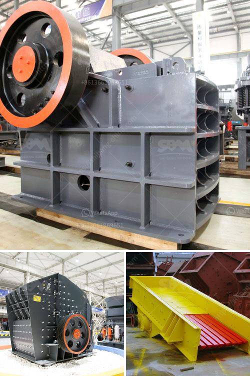

<h3>rock crushers prices</h3>
A rock crusher is a vital machine in the mining industry. It is used to break down large rocks into smaller, more manageable pieces. Crushers are highly advantageous as they help in producing crushed stones, which are used in various construction projects, such as buildings, highways, and bridges. When considering purchasing a rock crusher, one must take into account several factors, including price, to ensure that the best decision is made.

The price of a rock crusher can vary greatly depending on the manufacturer, the type of machine, and its size. With so many options available, it is important to thoroughly research and compare prices before making a purchase. Here, we explore the main factors to consider when evaluating rock crusher prices.

Firstly, the type of rock crusher greatly affects its price. There are various types of rock crushers available, such as jaw crushers, cone crushers, impact crushers, and vertical shaft impactors. Each type has its own unique features, advantages, and disadvantages. Jaw crushers, for example, are typically used for primary crushing and are well-suited for materials with high hardness and large feed sizes. Cone crushers, on the other hand, are ideal for secondary and tertiary crushing and are better suited for materials with medium to high hardness. The type of rock crusher that best suits your needs will impact its price.

Secondly, the size and capacity of the rock crusher affect its price. Rock crushers come in different sizes, ranging from small portable units to large industrial crushers. The size and capacity of the machine will determine its efficiency and performance. Smaller crushers are generally cheaper and more portable, making them suitable for small-scale operations or temporary projects. In contrast, larger crushers are more expensive but can handle larger quantities of rocks and produce higher output rates.

Another crucial factor to consider is the manufacturer. Different manufacturers offer rock crushers with varying qualities, reliability, and after-sales support. Well-established and reputable manufacturers tend to offer higher-quality crushers, which often come with a higher price tag. However, the higher price may be justified by better performance, longer lifespan, and reliable customer support. It is essential to research the manufacturer's reputation and read reviews from other users to ensure you purchase from a reliable source.

Additionally, one must consider the cost of maintenance and operation of the rock crusher. Some crushers require regular maintenance and spare parts replacements, which can add to the overall costs. It is advisable to assess the maintenance requirements and associated costs before finalizing the purchase. Similarly, the energy consumption and operational costs of the machine should be taken into account. Opting for energy-efficient crushers can help save costs in the long run.

Lastly, it is important to compare prices from different suppliers or dealers. Prices can vary significantly depending on the supplier's location, overhead costs, and profit margins. By obtaining quotes from multiple sources, potential buyers can ensure they are getting the best deal available.

In conclusion, purchasing a rock crusher requires careful consideration of several factors, with price being one of the most important. To make an informed decision, potential buyers should evaluate the type of crusher, its size, the reputation of the manufacturer, as well as the associated maintenance and operational costs. Comparing prices from various suppliers will help ensure that the investment is cost-effective and delivers both the desired performance and longevity.
<h3>Contact us</h3><ul><li><strong>Whatsapp:&nbsp;<a href="https://wa.me/8613661969651">+8613661969651</a></strong></li><li><a href="https://swt.shibang-china.com/?git&amp;zhl&amp;rock crushers prices"><strong>Online Service(chat now)</strong></a></li></ul><h3>Related</h3><ul><li><a href='crushing plant for aggregate india.md'>crushing plant for aggregate india</a></li><li><a href='jaw crusher manufacturers in gujarat.md'>jaw crusher manufacturers in gujarat</a></li><li><a href='sample quarry business plan.md'>sample quarry business plan</a></li><li><a href='65 tph cone crusher complete plant.md'>65 tph cone crusher complete plant</a></li><li><a href='germany gypsum board manufacturing equipment.md'>germany gypsum board manufacturing equipment</a></li></ul>