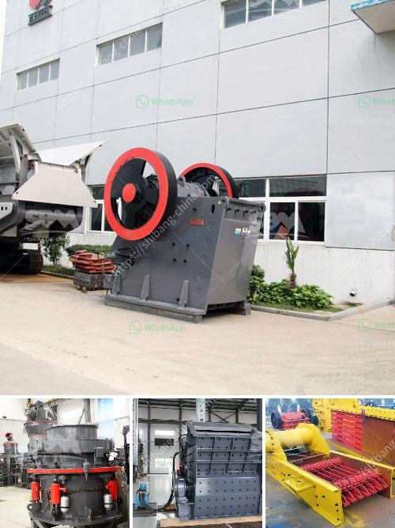

<h3>rock crushing equipment to make stone dust</h3>
Rock crushing equipment is a widely used apparatus in the mining and construction industry. These machines are specifically designed to reduce the size of large rocks into smaller rocks, gravel, or stone dust. With the advancement in technology, crushing equipment manufacturers have developed more efficient and robust machines that offer precise and consistent results.

One of the primary functions of rock crushing equipment is to produce stone dust. Stone dust, also known as rock dust or quarry dust, is created by crushing rocks and stones to different sizes. This versatile material is widely used in various construction applications, including roads, buildings, and landscaping.

The process of creating stone dust involves feeding large rocks and stones into a crushing machine. The rocks are then crushed to smaller sizes using a combination of impact, compression, and attrition forces. Once the stones are reduced to the desired size, they pass through a series of screens, which further separate them into different grades.

The size of the stone dust produced depends on the mesh size of the screens used in the crushing equipment. Different grades of stone dust are used for different purposes. Finer grades, such as 0-6mm or 0-10mm, are commonly used for road construction, while coarser grades, such as 0-25mm or 0-40mm, are used for landscaping and drainage applications.

Stone dust offers several advantages in construction projects. Firstly, it acts as a solid base or sub-base material for roads, helping to stabilize the underlying soil and prevent settling and erosion. The compact nature of stone dust also improves the load-bearing capacity of the road, making it more durable and resistant to heavy traffic.

In building construction, stone dust is often used as an ingredient in concrete and mortar mixes. It helps to improve the workability of the concrete and enhances its strength and durability. The fine particles of stone dust fill the voids between larger aggregates, resulting in a dense and cohesive mixture. Additionally, the angular shape of stone dust particles provides better interlocking, which further strengthens the concrete.

Stone dust can also be used as a landscaping material. It can be spread over the ground to create a stable and low-maintenance surface for pathways, walkways, or driveways. Its natural appearance and neutral color blend well with various design aesthetics, making it a popular choice among homeowners and landscape architects.

Moreover, stone dust is environmentally friendly. It is a byproduct of crushing rocks and does not require additional energy or resources for its production. By utilizing stone dust as a construction material, we can reduce the extraction of natural resources and minimize the environmental impact associated with quarrying operations.

In conclusion, rock crushing equipment plays a crucial role in producing stone dust for various construction applications. The machines efficiently crush rocks and stones into smaller sizes, which are then used as a base material for roads, a component in concrete mixes, or a landscaping material. Stone dust offers numerous benefits, including improved stability, enhanced durability, and reduced environmental impact. By utilizing this versatile material, we can create sustainable and resilient infrastructure while minimizing our reliance on natural resources.
<h3>Contact us</h3><ul><li><strong>Whatsapp:&nbsp;<a href="https://wa.me/8613661969651">+8613661969651</a></strong></li><li><a href="https://swt.shibang-china.com/?git&amp;zhl&amp;rock crushing equipment to make stone dust"><strong>Online Service(chat now)</strong></a></li></ul><h3>Related</h3><ul><li><a href='pakistan chromite crusher equipment.md'>pakistan chromite crusher equipment</a></li><li><a href='jaw crusher dealer in dubai.md'>jaw crusher dealer in dubai</a></li><li><a href='diatomaceous earth processing machinery.md'>diatomaceous earth processing machinery</a></li><li><a href='rock hammer mill for sale.md'>rock hammer mill for sale</a></li><li><a href='distribuidor de equipos para laboratorio chancadoras.md'>distribuidor de equipos para laboratorio chancadoras</a></li></ul>