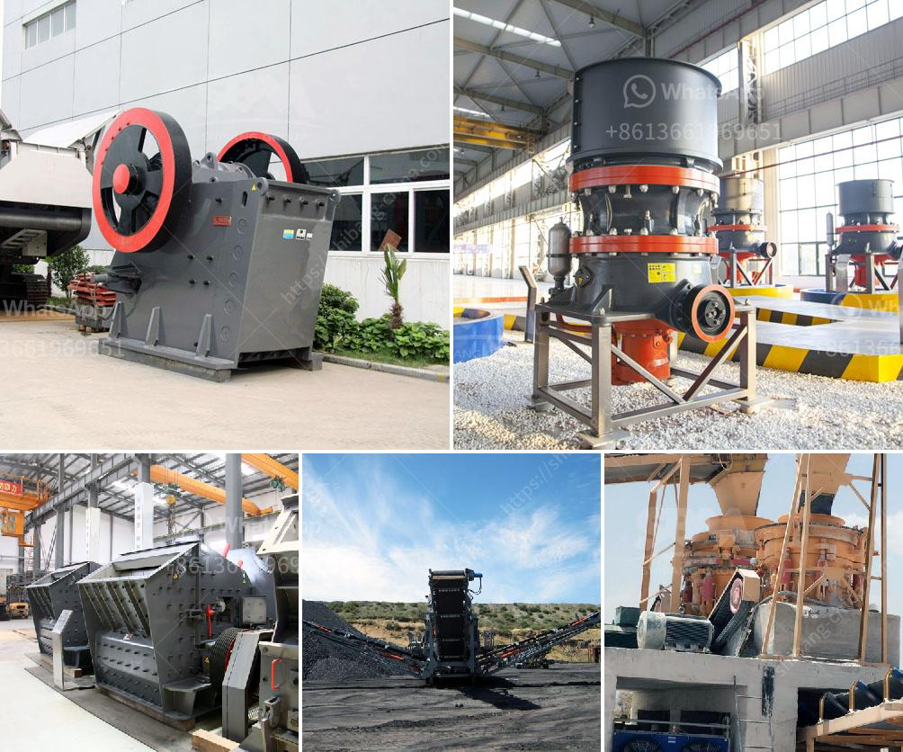

<h3>rock crushing machines</h3>
Rock crushing machines are essential equipment for any construction or mining project. They are used to reduce the size of large rocks into smaller, more manageable pieces. Different types of rock crushing machines are available today, each with unique characteristics and modes of operation.

One common primary crusher type for aggregates production is the jaw crusher. This type of machine is characterized by its sturdy and durable construction, as well as its excellent crushing capability. It can process a wide variety of materials, including hard rocks, ores, and recycled concrete. The jaw crusher utilizes a fixed jaw plate and a moving jaw plate to apply pressure and crush the material.

Another popular rock crushing machine is the cone crusher. Compared to the jaw crusher, this machine is more versatile and can crush rocks of various hardness levels. It is commonly used in secondary and tertiary crushing stages to produce fine or even extra-fine materials. The cone crusher operates by squeezing the rock between an eccentrically gyrating mantle and a concave surface.

For projects requiring smaller rock sizes, impact crushers are often the preferred choice. These machines use high-speed rotating rotor blades to strike and break the rock, resulting in a high reduction ratio. Impact crushers are particularly effective for producing aggregates and creating paved or unpaved roads. Some models are equipped with a screen deck to separate the desired size of material from the discharged oversize.

Additionally, various specialized machines are designed to tackle specific rock crushing tasks. For instance, gyratory crushers are large machines characterized by their steep cone angle and eccentricity. They are commonly used in the mining industry to handle large-sized rocks and ores. Hammer mills, on the other hand, are designed for finer materials and can be used for both primary and secondary crushing.

Choosing the right rock crushing machine for a particular project depends on several factors. The hardness, size, and shape of the rock, as well as the desired end product size, should be taken into consideration. Additionally, the machine's capacity, power requirements, and maintenance needs are vital aspects to consider.

When purchasing a rock crushing machine, it is essential to select a reputable manufacturer with a proven track record. Reliable manufacturers will provide detailed specifications and technical information about their machines. They will also offer support and after-sales services.

Regular maintenance and proper usage are critical for the optimal performance and longevity of rock crushing machines. Adequate lubrication, inspections, and repairs must be carried out based on the manufacturer's recommendations. Furthermore, operators should be trained on the safe operation of the equipment to prevent accidents and maximize operational efficiency.

In conclusion, rock crushing machines are essential equipment in construction, mining, and aggregate industries. Different types and models are available, each suited for specific projects and rock types. Considerations such as rock hardness, desired product size, and machine capacity should guide the selection process. Additionally, proper maintenance and operator training are crucial for optimal performance. By investing in the right machine and following recommended practices, project efficiency and profitability can be maximized.
<h3>Contact us</h3><ul><li><strong>Whatsapp:&nbsp;<a href="https://wa.me/8613661969651">+8613661969651</a></strong></li><li><a href="https://swt.shibang-china.com/?git&amp;zhl&amp;rock crushing machines"><strong>Online Service(chat now)</strong></a></li></ul><h3>Related</h3><ul><li><a href='graphite manufacturing youtube.md'>graphite manufacturing youtube</a></li><li><a href='zevith simple stone crushers kenya.md'>zevith simple stone crushers kenya</a></li><li><a href='gravimetric centrifugal gold concentrator.md'>gravimetric centrifugal gold concentrator</a></li><li><a href='cost of gypsum mining equipment.md'>cost of gypsum mining equipment</a></li><li><a href='grinding machinery manufecture in africa.md'>grinding machinery manufecture in africa</a></li></ul>