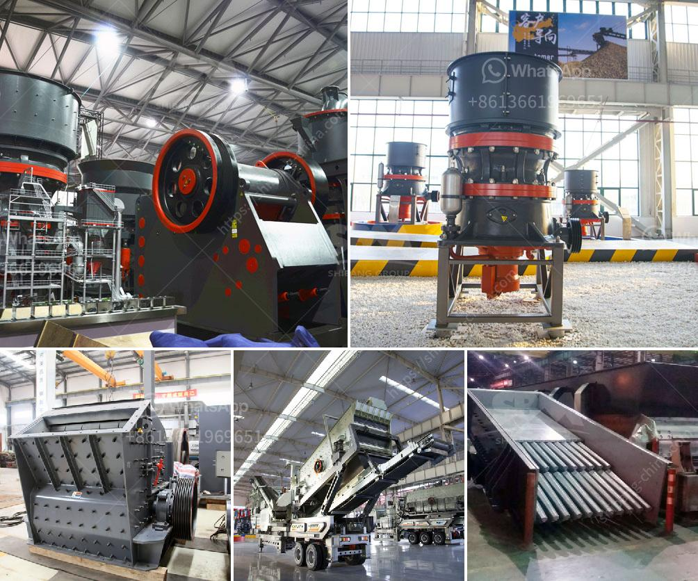

<h3>rock crushing plant capacity 250 tph</h3>
Rock crushing plants are becoming more common as the demand for aggregates increases. According to recent trends, the global construction industry is expected to grow significantly in the coming years. This growth is driven by urbanization, infrastructure projects, and the need for housing. As a result, the demand for construction aggregates, such as crushed rock, is also expected to soar.

A rock crushing plant is a machine designed to reduce the size of large rocks into smaller rocks, gravel, or rock dust. This plant employs heavy-duty crushing equipment to crush raw materials into aggregate products that are used in construction applications. The raw materials are fed into the primary crusher, which breaks them down into smaller pieces. From there, the crushed rocks are further processed to produce various sizes of aggregates.

One popular capacity for a rock crushing plant is 250 tons per hour. Some factors that contribute to the capacity of a rock crushing plant include:

- The hardness of the rocks: If the rocks are very hard, it will take a significant amount of energy to crush them, which in turn will result in higher operating costs.

- The size of the rock: The larger the rock, the more energy it takes to crush it. Therefore, it is important to assess the feed size and determine the required capacity for the plant.

- The type of rock: Some rocks are more challenging to crush than others. For example, igneous rocks are generally harder and more abrasive than sedimentary rocks. Therefore, the type of rock being crushed will affect the capacity of the plant.

- The moisture content of the rocks: Moisture can impact the crushing process. Wet or sticky rocks are more challenging to crush and might require additional equipment or methods to overcome this hurdle.

To achieve a capacity of 250 tph, the plant should be capable of processing at least 275 tph. This means that the primary crusher can handle rocks up to 275 mm in size. Any rocks larger than this size would need to be broken down by secondary or tertiary crushers to achieve the desired product size.

Additionally, the plant should be equipped with efficient screening equipment to ensure that the final product meets the required specifications. Oversized rocks or unwanted materials should be screened out to prevent issues during the concrete or asphalt production processes.

In conclusion, a rock crushing plant with a capacity of 250 tph is an essential machine in the construction industry. This plant allows you to crush rocks into different sizes, which is necessary for the production of concrete, asphalt, and other construction materials. With the increasing demand for aggregates, it is expected that the capacity of rock crushing plants will continue to grow in the future.
<h3>Contact us</h3><ul><li><strong>Whatsapp:&nbsp;<a href="https://wa.me/8613661969651">+8613661969651</a></strong></li><li><a href="https://swt.shibang-china.com/?git&amp;zhl&amp;rock crushing plant capacity 250 tph"><strong>Online Service(chat now)</strong></a></li></ul><h3>Related</h3><ul><li><a href='cost of vertical roller mill clinker grinding.md'>cost of vertical roller mill clinker grinding</a></li><li><a href='rock hammer mill for sale.md'>rock hammer mill for sale</a></li><li><a href='busines project proposal for stone crusher.md'>busines project proposal for stone crusher</a></li><li><a href='crusher plant price.md'>crusher plant price</a></li><li><a href='list used cement factory for sale in germany.md'>list used cement factory for sale in germany</a></li></ul>