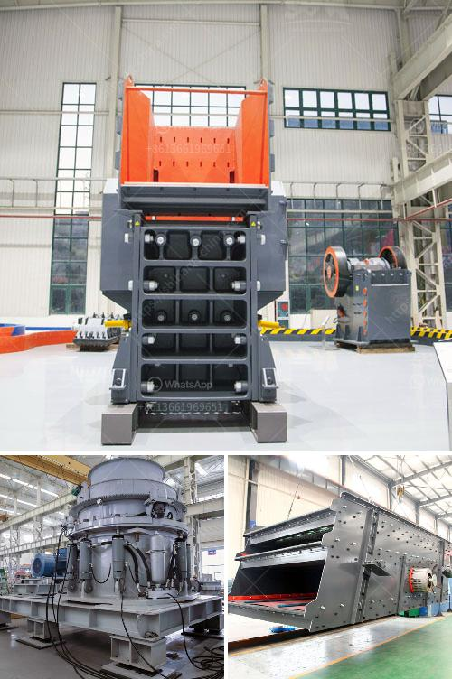

<h3>rock crushing plant mobile</h3>
The mobile rock crushing plant has become a popular choice for many rock crushing contractors worldwide due to its flexibility and convenient operation. The unit features a robust design, long-lasting components, and steady performance, making it a reliable solution for crushing operations in various industries. Whether you are a quarry owner, mining company, or contractor, the mobile rock crushing plant offers efficient, cost-effective, and versatile solutions for your crushing needs.

One of the key advantages of the mobile rock crushing plant is that it can be moved easily. This eliminates the need for transportation permits and costly transportation fees. The plant can be quickly set up at the desired location, allowing you to start crushing rocks within a short timeframe. It is an ideal solution for contractors who need to move their equipment frequently from site to site.

The mobile rock crushing plant is equipped with different crushing equipment, each of which has its own function. Jaw crushers, cone crushers, impact crushers, and VSI crushers are the main types of crushing machines used in this plant. They are rugged, reliable, and robust machines that are designed to handle high levels of crushing work. Different crushing equipment can be combined to form an efficient crushing circuit to meet specific production requirements.

The mobile rock crushing plant is equipped with a portable generator or diesel engine, which can keep the unit working even in remote locations without access to the grid. With the generator or engine, the plant can work continuously for hours, ensuring a steady supply of crushed rocks for various applications. This feature makes the mobile rock crushing plant particularly suitable for remote sites with limited access to electricity.

Another advantage of the mobile rock crushing plant is its ability to crush rocks of different sizes directly on-site. This eliminates the need for transporting rocks to a centralized crushing facility, reducing transportation costs and saving time. Whether you need fine aggregates or coarse aggregates, the plant can produce the desired size of crushed rocks directly at the job site.

The mobile rock crushing plant offers great flexibility in terms of application. It can crush a wide range of materials, including concrete, asphalt, limestone, granite, and other types of rock. This versatility makes the plant suitable for different industries, such as construction, mining, quarrying, and recycling. You can use the plant to produce aggregates for road construction, concrete production, or other applications relevant to your business.

In conclusion, the mobile rock crushing plant is a reliable and efficient solution for rock crushing operations. Its flexibility, mobility, and versatility make it an ideal choice for contractors and quarry owners alike. With the ability to move easily and crush rocks on-site, the plant provides a cost-effective and convenient solution for various industries. Whether you need fine or coarse aggregates, the mobile rock crushing plant can deliver the desired output efficiently. Invest in this plant and experience the benefits it brings to your crushing operations.
<h3>Contact us</h3><ul><li><strong>Whatsapp:&nbsp;<a href="https://wa.me/8613661969651">+8613661969651</a></strong></li><li><a href="https://swt.shibang-china.com/?git&amp;zhl&amp;rock crushing plant mobile"><strong>Online Service(chat now)</strong></a></li></ul><h3>Related</h3><ul><li><a href='gypsum machinery plant from france.md'>gypsum machinery plant from france</a></li><li><a href='limestone hammer mill process.md'>limestone hammer mill process</a></li><li><a href='quarry machine manfacturer.md'>quarry machine manfacturer</a></li><li><a href='rock crushing equipment to make stone dust.md'>rock crushing equipment to make stone dust</a></li><li><a href='quartz powder mill shanghaiu.md'>quartz powder mill shanghaiu</a></li></ul>