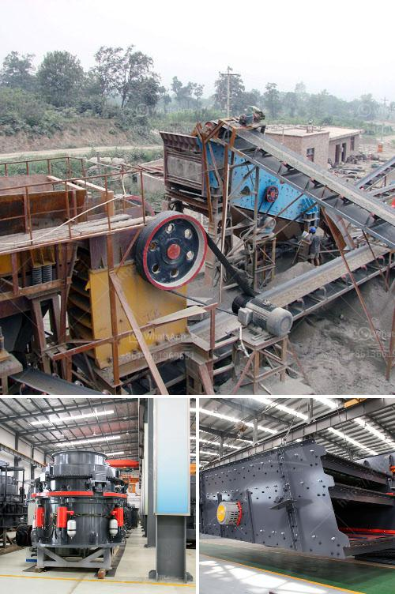

<h3>rock cutting and grinding machine price</h3>
Rock cutting and grinding machines are currently being used in various industries to perform the tedious and exhausting task of cutting and grinding rocks. These machines are not only efficient and easy to use but also come with a reasonable price tag.

One of the main benefits of these machines is that they significantly reduce the effort and time taken to cut or grind rocks. Traditional methods of rock cutting involved using manual tools such as hammers and chisels, which were not only labor-intensive but also required extensive skill and training. With the advent of rock cutting and grinding machines, this process has become much simpler and efficient.

The price of these machines varies depending on several factors such as the brand, model, and specifications. However, on average, a high-quality rock cutting machine can cost anywhere between $300 to $500. The price largely depends on the size and diameter of the machine. Smaller machines that can handle rocks in the range of 2-4 inches often cost around $300, while larger machines capable of handling stones up to 8-10 inches can cost up to $500.

When purchasing a rock cutting or grinding machine, it is essential to consider certain factors. Firstly, the power and efficiency of the machine play a significant role in determining its price. Machines with higher horsepower and cutting capacity tend to be more expensive. Additionally, machines made using high-quality materials and advanced technology might come with a higher price tag.

Another vital aspect to consider is the durability and longevity of the machine. Investing in a robust and reliable machine that can withstand the wear and tear of regular use is crucial. While these machines may come at a slightly higher price, they often provide better value in the long run as they require fewer repairs and replacements.

Furthermore, it is essential to evaluate the after-sales services and warranty offered by the manufacturer or supplier. Machines that come with a warranty period and comprehensive customer support ensure peace of mind and can influence the purchasing decision.

Lastly, it is advisable to compare prices and features of different models before making the final purchase. Researching online, reading customer reviews, and consulting experts in the industry can provide valuable insights into the best machines available in the market at a given price range.

In conclusion, rock cutting and grinding machines have revolutionized the process of cutting and grinding rocks, making it quicker, more efficient, and less labor-intensive. With a price range of $300 to $500, these machines offer numerous benefits at a reasonable cost. It is crucial to consider factors such as power, durability, after-sales services, and warranty when selecting the appropriate machine for specific requirements. Investing in a high-quality machine with the right specifications ensures optimal performance and longevity.
<h3>Contact us</h3><ul><li><strong>Whatsapp:&nbsp;<a href="https://wa.me/8613661969651">+8613661969651</a></strong></li><li><a href="https://swt.shibang-china.com/?git&amp;zhl&amp;rock cutting and grinding machine price"><strong>Online Service(chat now)</strong></a></li></ul><h3>Related</h3><ul><li><a href='plant making bricks from marble.md'>plant making bricks from marble</a></li><li><a href='small scale crushers in south africa.md'>small scale crushers in south africa</a></li><li><a href='copper ore refinement processors philippines.md'>copper ore refinement processors philippines</a></li><li><a href='mobile crusher machine manufacturer.md'>mobile crusher machine manufacturer</a></li><li><a href='roller crusher equipment manufacturer.md'>roller crusher equipment manufacturer</a></li></ul>