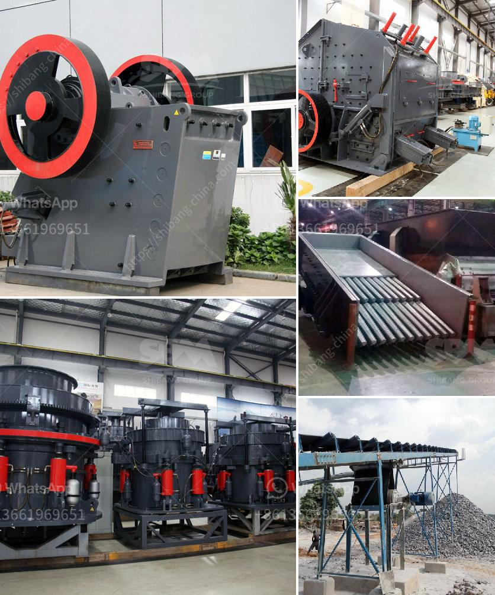

<h3>rock hammer mill for sale</h3>
If you have been searching for hammer mill equipment to process and grind rocks, then look no further. A rock hammer mill, also known as a hammer mill crusher, is a machine that utilizes hammers to break down materials such as rocks and minerals. This equipment is popular in many industries, including mining, agriculture, and construction.

The rock hammer mill for sale is made up of a steel drum that houses a shaft and hammers. The hammers are free to swing on the ends of the cross, or fixed to the central rotor. The rotor spins at a high speed while the hammers impact the material being fed into the chamber and break it down into smaller pieces.

One of the primary advantages of the rock hammer mill is its versatility. It can effectively crush a wide range of materials, including hard and brittle rocks, ores, minerals, and coal. The hammer mill design also ensures that there is minimal dust formation during operation, making it a preferred choice for crushing rocks in enclosed spaces.

The rock hammer mill is available in different sizes and capacities to suit various applications. Whether you need a small hammer mill for laboratory use or a heavy-duty machine for large-scale rock crushing, there is a rock hammer mill for sale that will meet your specific needs.

One of the best rock hammer mill models available for sale is the FSP series hammer mill. This model comes with a water-cooling chamber that significantly reduces the heat generated during operation. It allows for efficient processing of rock materials, and produces a consistently fine end product.

Another popular rock hammer mill model is the LT series. This model features a unique design that provides maximum durability and performance. It is ideal for crushing hard rocks and materials that are difficult to break down with other hammer mills.

When purchasing a rock hammer mill, it is crucial to consider factors such as its capacity, power requirements, and maintenance requirements. Additionally, you should also evaluate the reputation and reliability of the manufacturer or supplier. Choose a reputable company with a track record of producing high-quality hammer mills.

Once you have found the perfect rock hammer mill for sale, it is essential to follow the manufacturer's guidelines for installation and maintenance. Regular inspections and maintenance will ensure that the equipment remains in optimal condition and operates efficiently.

In conclusion, if you are in the market for a rock hammer mill, look no further. This versatile and powerful equipment can effectively process and crush various rocks and minerals. Whether you need a small hammer mill for laboratory use or a heavy-duty machine for large-scale rock crushing, there is a rock hammer mill for sale that will meet your specific requirements. Choose a reputable manufacturer or supplier and follow proper maintenance procedures to ensure the longevity and efficiency of the equipment. Invest in a rock hammer mill today and experience the benefits of efficient rock crushing.
<h3>Contact us</h3><ul><li><strong>Whatsapp:&nbsp;<a href="https://wa.me/8613661969651">+8613661969651</a></strong></li><li><a href="https://swt.shibang-china.com/?git&amp;zhl&amp;rock hammer mill for sale"><strong>Online Service(chat now)</strong></a></li></ul><h3>Related</h3><ul><li><a href='machinery from italy for gypsum powder production.md'>machinery from italy for gypsum powder production</a></li><li><a href='second hand stone crusher sale in india.md'>second hand stone crusher sale in india</a></li><li><a href='mining equipment for hire zimbabwe.md'>mining equipment for hire zimbabwe</a></li><li><a href='machine grinds talcum powder.md'>machine grinds talcum powder</a></li><li><a href='ulltra fine grinding mill.md'>ulltra fine grinding mill</a></li></ul>