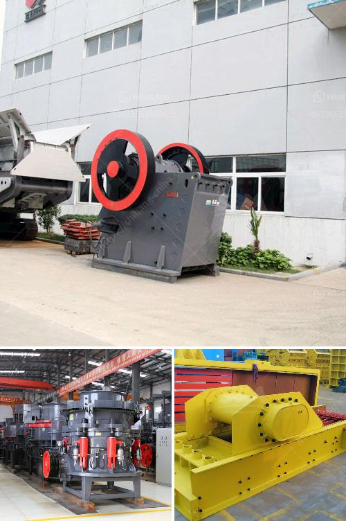

<h3>rock milling and grinding machine</h3>
Rock milling and grinding machinery is the cornerstone of many industries. It is critical to ensure efficiency and reliable operations in these machines. This article discusses the benefits of rock milling and grinding machines and highlights some key considerations for purchasing such equipment.

Rock milling and grinding machines are designed to turn large rocks into smaller particles, making them suitable for various applications. These machines are widely used in the mining, construction, and agricultural sectors, among others. They play a crucial role in the extraction of valuable minerals, the preparation of construction materials, and even the creation of energy.

One of the key benefits of rock milling and grinding machines is their ability to process a wide range of materials. These machines can handle rocks of different hardness levels, from soft limestone to hard granite. They are also capable of grinding and milling other materials like concrete, asphalt, and ores. This versatility makes them an indispensable tool for many industries where different materials need to be processed.

Another advantage of rock milling and grinding machines is their ability to achieve the desired particle size and shape. Depending on the specific application, the rock particles may need to be finely ground or coarse in nature. These machines can be adjusted to meet different requirements, allowing for precise control over the final product specifications. This is crucial in industries where particle size and shape are critical factors, such as in the production of construction materials or in the pharmaceutical industry.

When purchasing rock milling and grinding machines, there are several key considerations to keep in mind. Firstly, it is important to choose a machine that matches the specific requirements of the application. Factors such as material hardness, desired particle size, and expected production capacity need to be taken into account. Additionally, the machine's durability and reliability are crucial factors to consider to ensure long-term, trouble-free operation.

Maintenance and service requirements should also be thoroughly evaluated when selecting rock milling and grinding machines. Regular maintenance is essential to keep the machines operating at peak performance and to maximize their lifespan. It is important to choose machines that come with robust and accessible maintenance features, as well as reliable customer support from the manufacturer.

Furthermore, it is crucial to consider the safety features incorporated into the machine design. Rock milling and grinding machines involve high-powered motors and rotating parts, posing potential hazards to operators. Ensuring that the machine meets or exceeds safety standards is vital to protect workers and prevent accidents in the workplace. Features such as emergency stops, safety enclosures, and interlocking systems should be present to safeguard operators.

In conclusion, rock milling and grinding machines are essential equipment in various industries. They offer the capability to process a wide range of materials, achieve precise particle size and shape, and play a crucial role in various applications. When purchasing such machines, careful consideration of specific requirements, maintenance needs, safety features, and customer support is necessary. By selecting the right machine, businesses can ensure efficient operations and reliable production processes.
<h3>Contact us</h3><ul><li><strong>Whatsapp:&nbsp;<a href="https://wa.me/8613661969651">+8613661969651</a></strong></li><li><a href="https://swt.shibang-china.com/?git&amp;zhl&amp;rock milling and grinding machine"><strong>Online Service(chat now)</strong></a></li></ul><h3>Related</h3><ul><li><a href='stone crushing plants close to rotate.md'>stone crushing plants close to rotate</a></li><li><a href='marble crusher industry philippines.md'>marble crusher industry philippines</a></li><li><a href='cost of setting up a mini cement plant in india.md'>cost of setting up a mini cement plant in india</a></li><li><a href='crusher plant price.md'>crusher plant price</a></li><li><a href='picture of complete of quarry crushing plant nigeria.md'>picture of complete of quarry crushing plant nigeria</a></li></ul>