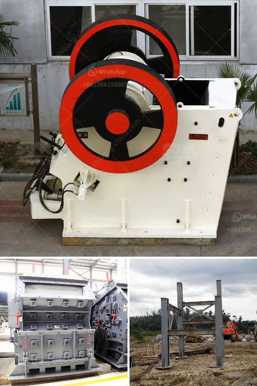

<h3>rock pulverizer crusher technologies</h3>
Rock pulverizer crusher technologies are the key to improving efficiency and maximizing profitability in the mining and construction industries. With the ever-increasing demand for materials, there is a need for machinery capable of reducing large rocks into smaller, more manageable sizes.

One of the most common technologies used in the rock pulverizer crusher is the jaw crusher. This machine works by compressing and crushing the rocks between two heavy jaws. It is known for its high efficiency, durable construction, and low maintenance requirements. The jaw crusher can handle various types of materials, including granite, basalt, limestone, and more. It is suitable for both primary and secondary crushing operations.

Another innovative technology in the rock pulverizer crusher is the cone crusher. This machine uses a rotating cone to crush rocks between its mantle and concave. Cone crushers are known for their ability to produce a cubical-shaped end product, which is highly desirable in many applications, such as road construction and concrete production. Additionally, cone crushers offer high production rates and a low operating cost.

Impact crushers are also widely used in the rock pulverizer crusher technologies. These crushers use a high-speed impact force to break rocks into smaller pieces. They are ideal for crushing materials with a high compressive strength, such as limestone and sandstone. Impact crushers are often used in mining operations, as they can handle large volumes of rocks and produce a uniform end product.

With the advancement of technology, rock pulverizer crusher machines have become more efficient and user-friendly. Many crushers now come equipped with features such as hydraulic systems, automatic settings, and advanced control systems. This allows operators to adjust the crusher settings easily and optimize production rates.

In conclusion, rock pulverizer crusher technologies play a crucial role in the mining and construction industries. They provide efficient and cost-effective solutions for reducing large rocks into smaller, more manageable sizes. Whether it's a jaw crusher, cone crusher, or impact crusher, these machines are essential equipment for any operation looking to maximize profitability and productivity.
<h3>Contact us</h3><ul><li><strong>Whatsapp:&nbsp;<a href="https://wa.me/8613661969651">+8613661969651</a></strong></li><li><a href="https://swt.shibang-china.com/?git&amp;zhl&amp;rock pulverizer crusher technologies"><strong>Online Service(chat now)</strong></a></li></ul><h3>Related</h3><ul><li><a href='stone crusher vibrating screen for sale.md'>stone crusher vibrating screen for sale</a></li><li><a href='marble and granite grinder and crusher.md'>marble and granite grinder and crusher</a></li><li><a href='diamond mining jaw crusher.md'>diamond mining jaw crusher</a></li><li><a href='pf series impact crusher.md'>pf series impact crusher</a></li><li><a href='gold mining equipment pdf.md'>gold mining equipment pdf</a></li></ul>