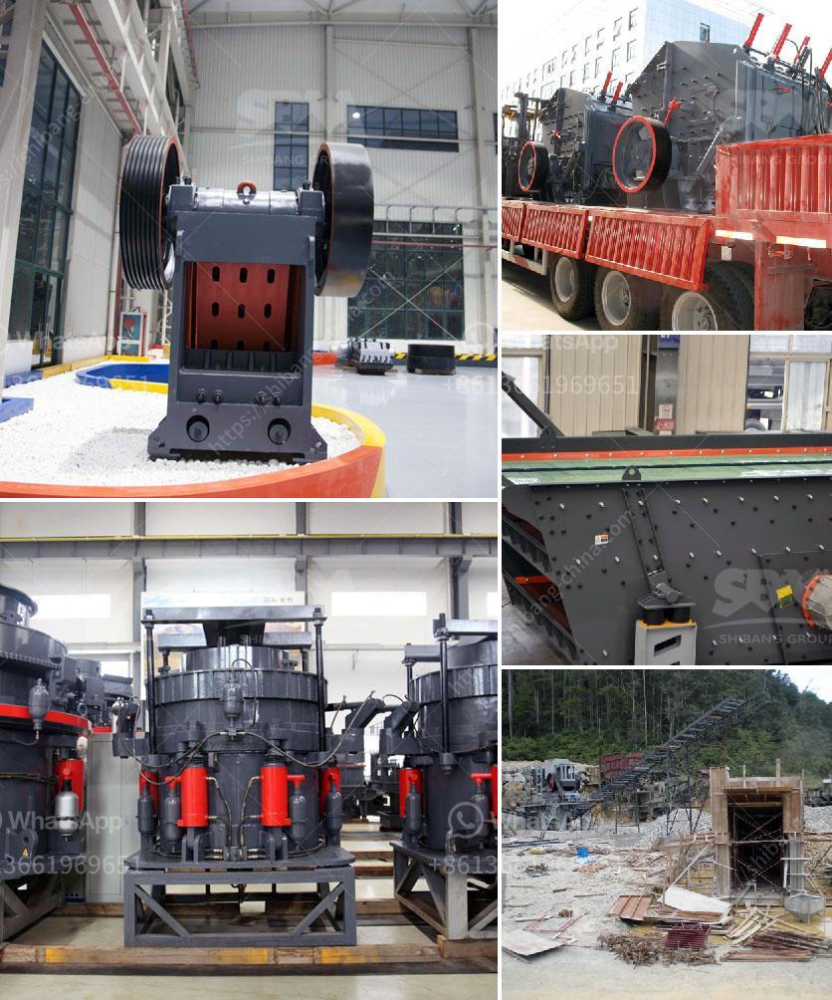

<h3>roll ball mill industries</h3>
Roll ball mill is a grinder for reducing hard materials to powder. A roll ball mill grinds material by rotating cylinder pots with balls causing the balls to fall back into the pots and onto the material to be ground. The pots rotate at a relatively slow speed, allowing the balls to cascade through the mill base, thus grinding or dispersing the materials.

Roll ball mills are highly efficient grinding systems, especially popular for rapid mixing of chemical samples. The mill pots make the mixing process more uniform and the materials are finely ground due to the continuously cascading balls. These mills are widely used in pharmaceutical, chemical, and agricultural industries, among others.

One of the main advantages of roll ball mills is their simplicity and flexibility. They can be used for wet or dry grinding and are suitable for grinding a variety of materials, including chemicals, ceramics, minerals, and ores. Additionally, the vertical design of the mill pots allows for controlled cooling or heating of the materials, making them ideal for temperature-sensitive samples.

The roll ball mill industry has witnessed significant growth in recent years, driven by the increasing demand for efficient grinding and mixing processes in various industries. Manufacturers constantly strive to improve the design and performance of roll ball mills, resulting in enhanced efficiency and productivity. Many companies in the industry have also introduced automated systems and advanced software for precise control of grinding parameters.

In conclusion, roll ball mills play a crucial role in various industries, offering efficient grinding and mixing processes for a wide range of materials. Their simplicity, flexibility, and reliable performance make them a popular choice for research laboratories, production facilities, and quality control departments. With ongoing advancements in design and technology, the roll ball mill industry is expected to continue its growth and contribute to the advancement of various sectors.
<h3>Contact us</h3><ul><li><strong>Whatsapp:&nbsp;<a href="https://wa.me/8613661969651">+8613661969651</a></strong></li><li><a href="https://swt.shibang-china.com/?git&amp;zhl&amp;roll ball mill industries"><strong>Online Service(chat now)</strong></a></li></ul><h3>Related</h3><ul><li><a href='ball mills price south africa.md'>ball mills price south africa</a></li><li><a href='stone crusher for tractors.md'>stone crusher for tractors</a></li><li><a href='jaw stone crusher for excavators.md'>jaw stone crusher for excavators</a></li><li><a href='jaw crushers for sale in saudi.md'>jaw crushers for sale in saudi</a></li><li><a href='crushing mineral crushing meaning.md'>crushing mineral crushing meaning</a></li></ul>