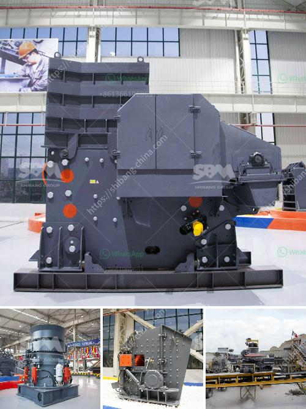

<h3>roll crusher for various size coal</h3>
A roll crusher is a piece of heavy-duty equipment used in mining and industrial processes. It features a pair of large wheels or cylinders mounted on horizontal axis. When rocks, ore, and other materials pass between the two cylinders, they are crushed or ground into smaller pieces. A roll crusher can be used in a wide variety of applications, including concrete recycling, coal mining, and mineral or metal production.

Some advantages of roll crushers are they give a very fine product size distribution and they produce very little dust or fines. Rolls crushers are effectively used in minerals crushing where the ores are not too abrasive and they are also used in smaller scale production mining of more abrasive metal ores, such as gold, coal, and iron. For example, a roll crusher may be employed in a coal mine where it is used to crush coal into smaller sizes for processing.

Regardless, the type of coal being crushed, the rollers should be the key concern. Some crushers have rollers with teeth or grooves that are able to grip the coal and pull it through the crushing chamber. Crushing and grinding machinery is the alpha of the coal-fired power industry, where the entire process of generating electricity begins.

Raw coal enters the top of the pulverizer through the raw coal feed pipe. The raw coal is then pulverized between the roll and rotating ring like teeth in a bowl-mill pulverizer. The pulverized coal is then conveyed by air to centrifugal classifiers. Properly sized pulverized coal exits the classifier into coal piping for transport to the furnace. Oversized coal particles are returned for grinding.

The coal particles of required dimension are discharged from the top of the classifier. In this process, the entire coal contained in the furnace and pulverizer system emits a large amount of heat. Crushing and grinding are responsible for the highest energy consumption. Up to 65% of the air needed for combustion is used to transport pulverized coal from the mill to the furnace. Moreover, the efficiency of combustion in pulverized coal-fired power plants is closely related to coal particle size. Smaller particles result in faster combustion, reducing the overall residence time in the furnace and increasing the release of thermal energy.

Roll crushers can grind coal to the desired fineness in a single pass, while accurately sizing the material for controlled product output and is particularly suited for sticky type material crushing such as lignite, coal, and coal with moisture content of more than 30%.

The equipment is able to break down difficult-to-process materials that tend to cake and requires consistent output particle size distribution. It is designed to prevent overfeeding and reduce blockage. The roll crushers are provided with overload protection and a separate safety door to prevent damage to the machine and ensure the safe completion of the process.

In conclusion, roll crushers are a valuable resource in the coal mining, recycling, and energy industries because they can quickly size and feed material for production. With roll crushers, reducing the size of coal, lime, soft and medium-hard materials, they are sometimes used as single-stage primary crushers.

The selection process of roll crushers is different depending upon the number of stages. By using a single-stage, double roll crusher rather than a traditional multi-stage crushing system, the rocks are easy to handle and can be reduced to smaller sizes, providing a better product for the downstream process.

Overall, roll crushers are an efficient and proven solution for various applications such as crushing coal and recycling concrete and other industrial materials. With its ability to function in demanding mining and production environments, the roll crusher is increasingly being utilized in coal mines and power plants for processing different materials.
<h3>Contact us</h3><ul><li><strong>Whatsapp:&nbsp;<a href="https://wa.me/8613661969651">+8613661969651</a></strong></li><li><a href="https://swt.shibang-china.com/?git&amp;zhl&amp;roll crusher for various size coal"><strong>Online Service(chat now)</strong></a></li></ul><h3>Related</h3><ul><li><a href='cost of a stone crusher.md'>cost of a stone crusher</a></li><li><a href='price of copper ore crushing machine.md'>price of copper ore crushing machine</a></li><li><a href='gold refining equipment machine plant.md'>gold refining equipment machine plant</a></li><li><a href='roll ball mill industries.md'>roll ball mill industries</a></li><li><a href='but concrete crushers nigeria.md'>but concrete crushers nigeria</a></li></ul>