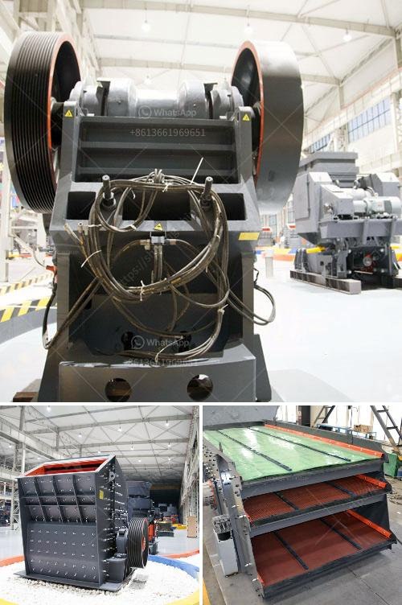

<h3>roll crusher zenith</h3>
Roll crushers are a widely used type of crusher due to their dependable performance and versatile design. The zenith roll crusher offers efficient crushing capabilities for various materials and applications.

The zenith roll crusher features a unique design that allows for automatic operation. It utilizes two parallel, counter-rotating rollers that crush the material between them. This design provides efficient and uniform crushing, ensuring a consistent product size.

The zenith roll crusher is also equipped with an advanced hydraulic control system that allows for easy adjustment of the crushing gap. This system ensures optimal performance and precise control over the final product size.

Furthermore, the zenith roll crusher is designed with durability in mind. The rollers are made of high-quality alloy steel and are heat-treated for increased strength and wear resistance. This ensures a longer lifespan and reduced maintenance requirements.

The versatility of the zenith roll crusher is another notable feature. It can handle a wide range of materials, including limestone, coal, shale, clay, and more. Its compact size and efficient operation make it suitable for both stationary and mobile crushing applications.

In conclusion, the zenith roll crusher offers reliable and efficient crushing capabilities. Its unique design, advanced hydraulic control system, and durable construction make it a preferred choice for various industries. Whether for crushing primary or secondary materials, the zenith roll crusher provides exceptional performance and quality.
<h3>Contact us</h3><ul><li><strong>Whatsapp:&nbsp;<a href="https://wa.me/8613661969651">+8613661969651</a></strong></li><li><a href="https://swt.shibang-china.com/?git&amp;zhl&amp;roll crusher zenith"><strong>Online Service(chat now)</strong></a></li></ul><h3>Related</h3><ul><li><a href='diagram of gold wash plant.md'>diagram of gold wash plant</a></li><li><a href='coal pulverizer manufacturers in south africa.md'>coal pulverizer manufacturers in south africa</a></li><li><a href='conveyor belts for material.md'>conveyor belts for material</a></li><li><a href='minister of gold mining ghana.md'>minister of gold mining ghana</a></li><li><a href='jaw crusher in dar es salaam.md'>jaw crusher in dar es salaam</a></li></ul>