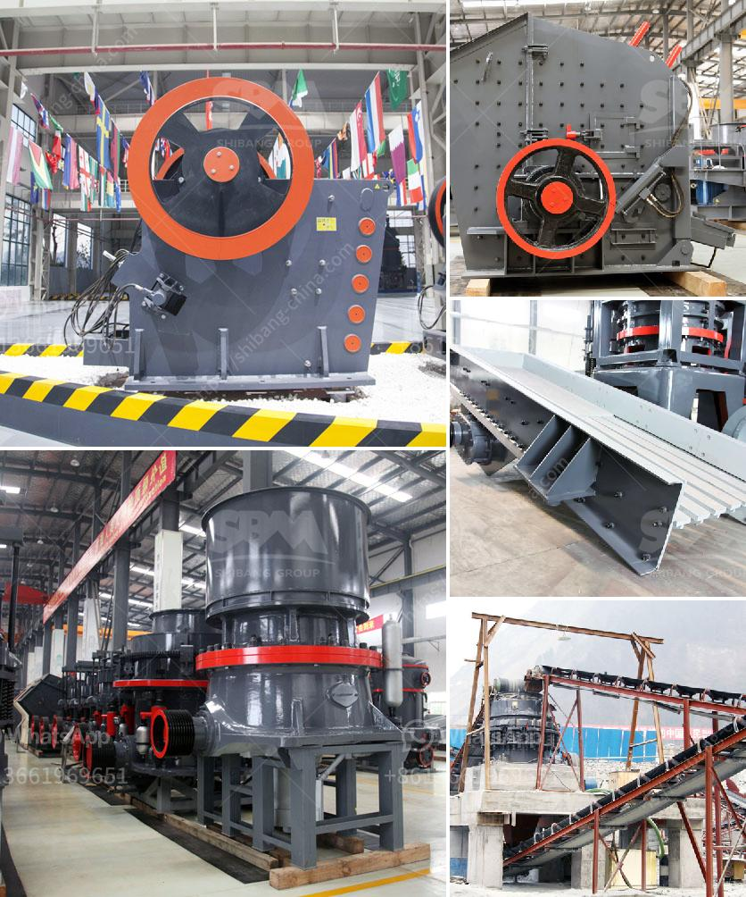

<h3>roll mill machine</h3>
Roll mill machines are widely used in various industries for processing, refining, and grinding of materials. These machines are capable of producing finely ground products with a uniform particle size distribution. The roll mill machine is an essential piece of equipment in any manufacturing facility as it provides a cost-effective solution for producing high-quality products.

One of the key advantages of a roll mill machine is its capability to grind and refine materials to a level of consistency that is not achievable with other grinding equipment. This machine consists of two cylindrical rolls that rotate in opposite directions. As the materials pass through the gap between the rolls, they are subjected to compression and shearing forces, resulting in the refinement of the particles. The adjustable gap between the rolls allows for precise control over the size of the final product.

The roll mill machine is commonly used in the food, pharmaceutical, and chemical industries. In the food industry, it is used for grinding spices, cocoa, sugar, and other ingredients to produce chocolate, pastes, and sauces. The pharmaceutical industry utilizes the machine to refine active pharmaceutical ingredients and produce tablets and capsules. In the chemical industry, the roll mill machine is used for processing pigments, dyes, and various chemicals.

Another advantage of the roll mill machine is its versatility in handling different types of materials. It can handle both soft and hard materials, such as plastics, rubber, clay, limestone, and metals. The ability to process a wide range of materials makes this machine suitable for a variety of applications.

In addition to grinding and refining, the roll mill machine can also be used for mixing and dispersing. Some machines are equipped with additional features, such as cooling or heating systems, which allow for temperature-sensitive materials to be processed. This flexibility makes the roll mill machine a versatile piece of equipment that can be customized to meet specific processing requirements.

Maintaining a roll mill machine is crucial for ensuring optimal performance and prolonging its lifespan. Regular inspections and cleaning of the machine are necessary to prevent the accumulation of debris or material buildup. Lubrication of the moving parts is also essential to reduce friction and maintain smooth operation. Additionally, periodic calibration of the machine is recommended to ensure accurate particle size distribution.

In conclusion, the roll mill machine is a valuable tool in various industries for processing, grinding, and refining materials. Its ability to produce uniform and consistent particle sizes makes it an indispensable piece of equipment in manufacturing facilities. Whether it is used for grinding spices, refining chemicals, or processing pharmaceutical ingredients, the roll mill machine provides a cost-effective solution for producing high-quality products. Proper maintenance and calibration are essential to ensure the longevity and optimal performance of this versatile machine.
<h3>Contact us</h3><ul><li><strong>Whatsapp:&nbsp;<a href="https://wa.me/8613661969651">+8613661969651</a></strong></li><li><a href="https://swt.shibang-china.com/?git&amp;zhl&amp;roll mill machine"><strong>Online Service(chat now)</strong></a></li></ul><h3>Related</h3><ul><li><a href='gold mining equipment pdf.md'>gold mining equipment pdf</a></li><li><a href='china vibrating screen.md'>china vibrating screen</a></li><li><a href='malaysia quarry crusher peninsula.md'>malaysia quarry crusher peninsula</a></li><li><a href='rock crushing plant mobile.md'>rock crushing plant mobile</a></li><li><a href='how to find out to crushing capacity of ball mill.md'>how to find out to crushing capacity of ball mill</a></li></ul>