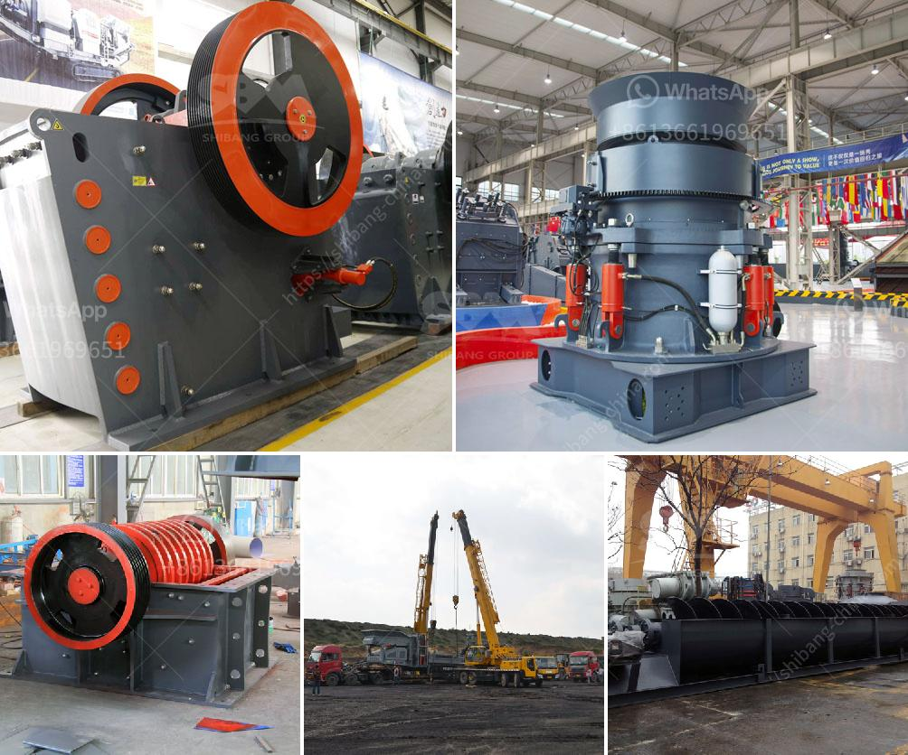

<h3>roll wheel pulverizer</h3>
The roll wheel pulverizer has proven to be a game-changer in the power generation industry. This innovative equipment has revolutionized the way coal is pulverized and combusted, resulting in higher efficiency and reduced emissions. With its superior grinding capacity and enhanced reliability, the roll wheel pulverizer has become the go-to technology for many power plants worldwide.

One of the key factors that sets the roll wheel pulverizer apart is its unique design. It features a rotating wheel equipped with a series of tires or rolls that pulverize the coal by crushing it against the grinding elements. This design offers several advantages over traditional pulverizers. Firstly, the multi-point loading system of the rolls ensures a more even and efficient coal grinding process. This results in improved combustion and reduced unburnt carbon in the ash, leading to lower emissions.

Another standout feature of the roll wheel pulverizer is its exceptional grinding capacity. The rolls are specifically designed to provide a high grinding force, allowing for the pulverization of large quantities of coal in a single pass. This capability not only increases the throughput of the pulverizer but also enables power plants to burn a wider range of coals, including lower-quality and high-moisture coals. As a result, operators can optimize their fuel choices and reduce their dependence on costly coal additives.

Furthermore, the roll wheel pulverizer has gained recognition for its enhanced reliability and reduced maintenance requirements. The durable design of the rolls, along with high-quality materials, enables them to withstand the significant forces and wear encountered during operation. This results in less frequent replacements and reduced downtime, ultimately leading to significant cost savings for power plant operators.

Additionally, the roll wheel pulverizer offers advanced controls and monitoring systems that enable real-time adjustments and optimization. This ensures that the pulverizer is operating at its peak efficiency, maximizing coal fineness and combustion performance. Furthermore, these automated systems provide valuable data on the pulverizer's operation, allowing operators to make informed decisions and identify potential issues before they escalate.

The environmental impact of power generation is a pressing concern, and the roll wheel pulverizer is contributing to mitigating this issue. By improving combustion efficiency and reducing unburnt carbon, this technology helps reduce greenhouse gas emissions and contribute to a greener energy landscape. Moreover, as power plants optimize their fuel choices and burn lower-quality coals, the roll wheel pulverizer also aids in reducing the overall environmental impact of coal mining and transportation.

In conclusion, the roll wheel pulverizer has transformed the power generation industry. Its innovative design, outstanding grinding capacity, reliability, and advanced controls have made it the go-to technology for many power plants worldwide. By increasing efficiency and reducing emissions, this revolutionary equipment is contributing to a greener and more sustainable energy future. As the demand for reliable and efficient power generation continues to grow, the roll wheel pulverizer is poised to remain at the forefront of the industry.
<h3>Contact us</h3><ul><li><strong>Whatsapp:&nbsp;<a href="https://wa.me/8613661969651">+8613661969651</a></strong></li><li><a href="https://swt.shibang-china.com/?git&amp;zhl&amp;roll wheel pulverizer"><strong>Online Service(chat now)</strong></a></li></ul><h3>Related</h3><ul><li><a href='jaw stone crusher for excavators.md'>jaw stone crusher for excavators</a></li><li><a href='size of balls in ball mill.md'>size of balls in ball mill</a></li><li><a href='limestone crushers in ghana.md'>limestone crushers in ghana</a></li><li><a href='300tpd cement plant price.md'>300tpd cement plant price</a></li><li><a href='crushers for rent cincinnati.md'>crushers for rent cincinnati</a></li></ul>