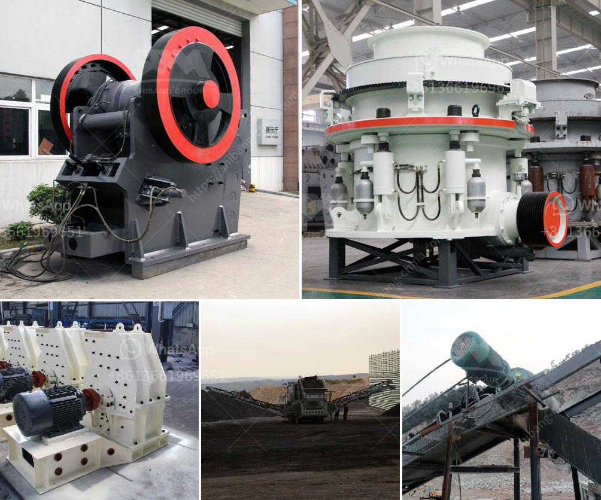

<h3>roller crusher cad detail drawing</h3>
Roller crushers are compression-based crushers that have a long history of productive use in the mining industry. The basic concept behind these crushers is to provide an efficient and reliable method of breaking down hard and abrasive materials, such as minerals, rocks, ores, and cement clinker, into smaller sizes. However, the key to their success lies in their detailed design, which includes intricate CAD drawings that ensure precision and optimal functionality.

CAD (Computer-Aided Design) software is an invaluable tool in modern engineering and design. It enables engineers to create, modify, analyze, and optimize products by generating accurate digital representations. When it comes to roller crushers, CAD detail drawings play a crucial role in the overall design. 

These technical drawings provide a detailed portrayal of the crusher's key components, such as the crushing roll assembly, frame, and hopper. They outline the dimensions, tolerances, and materials required for construction, ensuring that manufacturing and assembly processes are carried out accurately.

1. Crushing Roll Assembly: The heart of a roller crusher is the roll assembly. It consists of two cylindrical rolls with a specific diameter and length, each equipped with a hard-wearing surface. CAD detail drawings illustrate the precise dimensions of each roll and their interrelationship to promote an optimized crushing process.

2. Frame: The crusher's frame provides structural support and ensures the machine's stability. Detailed CAD drawings specify the shape, size, and material required for the frame construction. This information allows manufacturers to fabricate a robust and durable frame assembly.

3. Hopper: The hopper acts as a feed system for the materials to be crushed. It is important that the hopper is designed with the accurate dimensions and angles to allow a consistent flow of material into the crushing zone. CAD detail drawings depict the hopper's layout and provide a blueprint for its fabrication.

Precision and accuracy are critical in roller crusher design. CAD detail drawings offer a range of benefits, including:

1. Enhanced Efficiency: CAD software enables engineers to optimize the crusher's design, improving its efficiency and reducing the potential for unexpected breakdowns or inefficiencies.

2. Quality Control: By incorporating CAD detail drawings into the manufacturing process, manufacturers can ensure a high level of quality control. Each component can be constructed precisely, resulting in a reliable and robust crusher.

3. Cost Optimization: Accurate CAD detail drawings provide the opportunity to optimize material usage and minimize waste during the manufacturing process, leading to cost savings.

Roller crusher CAD detail drawings are essential in engineering reliable and efficient crushers. Through these detailed representations, engineers can design components that are precisely manufactured to meet the crushing demands of various materials. CAD drawings enhance the quality control process and allow for cost optimization, ensuring the production of durable and highly functional roller crushers.
<h3>Contact us</h3><ul><li><strong>Whatsapp:&nbsp;<a href="https://wa.me/8613661969651">+8613661969651</a></strong></li><li><a href="https://swt.shibang-china.com/?git&amp;zhl&amp;roller crusher cad detail drawing"><strong>Online Service(chat now)</strong></a></li></ul><h3>Related</h3><ul><li><a href='japan crusher equipment.md'>japan crusher equipment</a></li><li><a href='hammer mill for clay.md'>hammer mill for clay</a></li><li><a href='to see models of vibrating screens.md'>to see models of vibrating screens</a></li><li><a href='stone crusher in oman.md'>stone crusher in oman</a></li><li><a href='used gold mining equipment for sale in south africa.md'>used gold mining equipment for sale in south africa</a></li></ul>