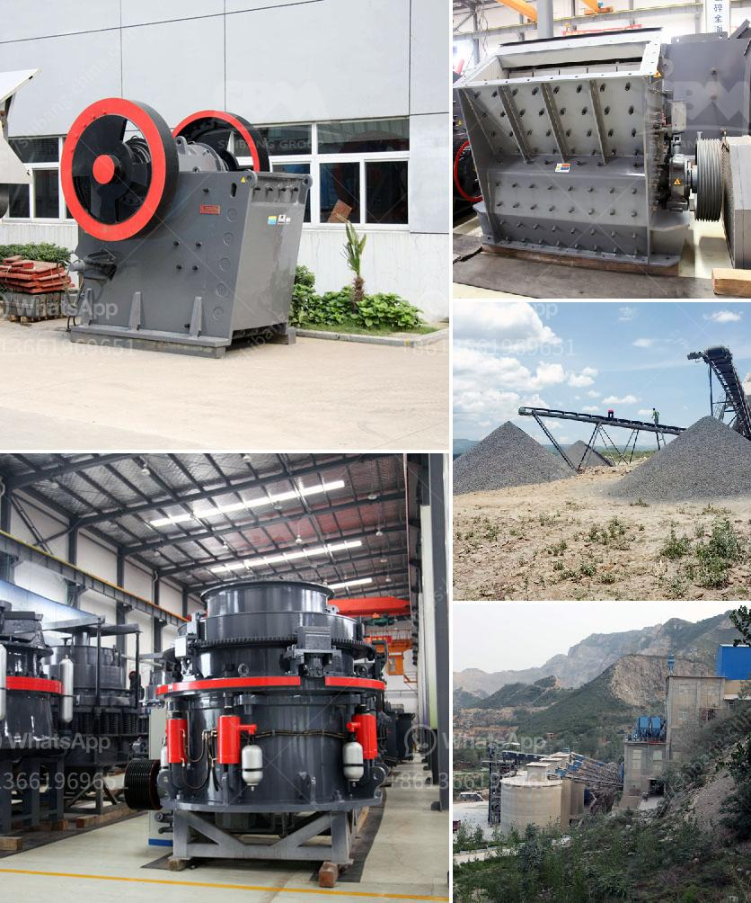

<h3>roller crusher discount</h3>
In today's competitive market, where industries strive to maximize efficiency and reduce costs, discounts play a crucial role in attracting customers. One such enticing offer currently making waves in the crushing machinery industry is the roller crusher discount. With the potential to revolutionize various industrial sectors, roller crushers are gaining popularity, and the discount makes them even more appealing.

Roller crushers, also known as roll crushers, have been used for decades in mining, construction, and recycling industries to efficiently break down large rocks, minerals, or construction debris into smaller, more manageable pieces. Their rugged design, coupled with high crushing efficiency, durability, and ease of operation, has made them indispensable in several applications.

The roller crusher discount is an excellent opportunity for both established and new businesses to upgrade their crushing machinery and reap the benefits. One of the notable advantages of roller crushers is their ability to produce a uniform and consistent product size. This ensures that the end product meets the desired specifications, allowing for better quality control and increased customer satisfaction.

Moreover, roller crushers are known for their energy efficiency. With their unique crushing mechanism and less power consumption compared to other crushing alternatives, roller crushers enable businesses to reduce their overall energy costs. This is particularly important in today's environmentally conscious world, where organizations strive to minimize their carbon footprint.

Another significant advantage of roller crushers is their versatility. These machines can handle a wide range of materials, including ores, coal, limestone, clay, and even sticky substances. This versatility is a valuable asset for industries dealing with diverse raw materials, as it eliminates the need for multiple crushing machines, saving both time and money.

The roller crusher discount, ranging from percentage discounts to free additional components, encourages businesses to invest in this innovative technology while reducing their financial burden. By taking advantage of the discount, companies can acquire advanced crushing machinery at a significantly lower cost, leading to increased productivity and profitability in the long run.

However, it is crucial for buyers to conduct thorough research and choose a reputable supplier when purchasing roller crushers. Quality and reliability should never be compromised, as these factors directly impact the performance and longevity of the machinery. Therefore, buyers should carefully evaluate the supplier's track record, customer reviews, and after-sales support to ensure a smooth and satisfactory experience.

In conclusion, the roller crusher discount offers an excellent opportunity for businesses to upgrade their crushing machinery and benefit from improved productivity, cost-effectiveness, and versatility. The discount allows for a reduced initial investment, making it a golden opportunity for both established and new players in the industry. Nevertheless, buyers must prioritize quality and choose a trusted supplier to make the most of this discount. So, if you are in the market for a crusher that optimizes your crushing process while maximizing cost-savings, don't miss out on the roller crusher discount – it may be the key to unlocking your business's crushing potential.
<h3>Contact us</h3><ul><li><strong>Whatsapp:&nbsp;<a href="https://wa.me/8613661969651">+8613661969651</a></strong></li><li><a href="https://swt.shibang-china.com/?git&amp;zhl&amp;roller crusher discount"><strong>Online Service(chat now)</strong></a></li></ul><h3>Related</h3><ul><li><a href='jaw stone crusher for excavators.md'>jaw stone crusher for excavators</a></li><li><a href='marble crusher in china.md'>marble crusher in china</a></li><li><a href='crusher stone price south africa.md'>crusher stone price south africa</a></li><li><a href='china jaw crusher pe 150 250 in philippines.md'>china jaw crusher pe 150 250 in philippines</a></li><li><a href='vibrating screens manufacturer south africa.md'>vibrating screens manufacturer south africa</a></li></ul>