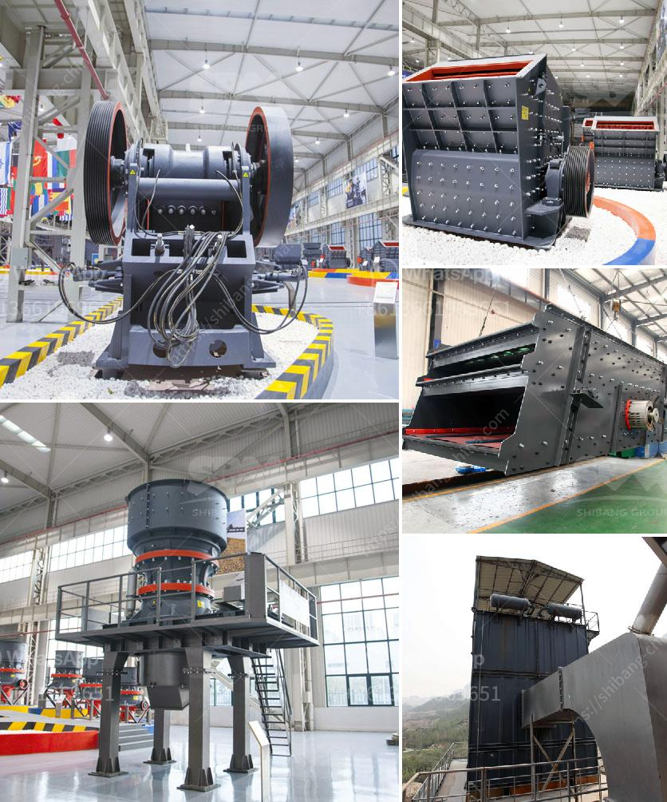

<h3>roller crusher equipment manufacturer</h3>
When it comes to crushing materials, roller crushers are one of the most effective and popular choices. With its ability to crush materials into specific sizes, the roller crusher equipment manufacturer has managed to craft the machinery that can fulfill any requirement in crushing materials. Whether you are in construction, mining, or any other industry requiring materials to be crushed, roller crushers are the go-to choice.

The roller crusher equipment manufacturer designs, develops, and manufactures roller crushers specifically for the crushing needs of various industries such as mining, construction, material processing, and other relevant industries. The roller crushing equipment provides a simple and efficient way to process materials, crushing them to the desired size and discharging them onto a conveyor, ready for the next step in the process.

One of the key advantages of roller crusher equipment is its ability to handle a wide variety of materials. Roller crushers are capable of crushing hard, brittle materials like coal, limestone, and metal ores into a fine powder or small particles. These crushers are powerful and efficient, and have the capacity to crush aggregate materials, such as cement clinker, along with other mineralized and non-mineralized materials.

The roller crusher equipment manufacturer has a vast network of skilled engineers who can provide solutions to customers in need of roller crushers. The roller crusher equipment manufacturer strives to ensure their machines are equipped with advanced technology. The roller crusher equipment manufacturer offers a comprehensive range of products, which have received excellent feedbacks from their clients. Below are some of the advantages of using roller crushers:

1. High crushing efficiency: Roller crushers are known for their excellent efficiency in crushing materials. The roller crusher equipment manufacturer ensures that the equipment is efficient, reliable, and durable. This results in a smooth and trouble-free operation, making the roller crushers a cost-effective solution.

2. Versatile applications: Roller crushers can handle various materials, making them suitable for a wide range of industries. They are commonly used in mining, construction, and material processing industries, crushing materials such as coal, limestone, clay, mineral ore, and more.

3. Low maintenance: The roller crusher equipment manufacturer designs their machines to require minimal maintenance. This reduces downtime and increases productivity, making roller crushers a practical choice for busy industries.

4. Customizable solutions: The roller crusher equipment manufacturer provides tailored solutions to meet the specific requirements of their clients. They understand that each industry and application has unique needs, and they work closely with their customers to deliver customized roller crushers that meet their exact specifications.

In conclusion, roller crushers are a versatile and efficient solution for industries requiring material crushing. The roller crusher equipment manufacturer offers a wide range of products designed to provide unmatched crushing efficiency. These machines are durable, reliable, and capable of handling various materials. With customizable solutions and low maintenance requirements, roller crushers are the ideal choice for businesses in need of reliable crushing equipment.
<h3>Contact us</h3><ul><li><strong>Whatsapp:&nbsp;<a href="https://wa.me/8613661969651">+8613661969651</a></strong></li><li><a href="https://swt.shibang-china.com/?git&amp;zhl&amp;roller crusher equipment manufacturer"><strong>Online Service(chat now)</strong></a></li></ul><h3>Related</h3><ul><li><a href='mining equipment used during gold rush.md'>mining equipment used during gold rush</a></li><li><a href='ball mill design calculation.md'>ball mill design calculation</a></li><li><a href='jaw crusher price list 150 x 200mm.md'>jaw crusher price list 150 x 200mm</a></li><li><a href='coal mining equipment in spain.md'>coal mining equipment in spain</a></li><li><a href='vrm cement grinding.md'>vrm cement grinding</a></li></ul>