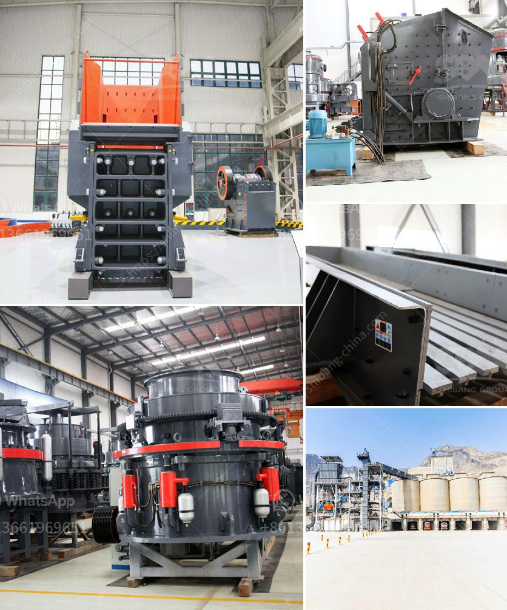

<h3>roller crusher for coal</h3>
Roller crusher is a kind of mechanical equipment commonly used in crushing ore processing. Roller crusher is a key piece of mechanical equipment that can not only be used for crushing coal, but also many other minerals and materials. Why is it called a roller crusher? It is because it uses a roller to crush and grind large-sized coal and rocks.

When the roller crusher is working, the teeth on the roller surface can bite, crush, and grind coal, transforming them into smaller sizes. In this way, the materials are crushed through the pressure generated by the two crushing rollers. Unlike traditional jaw crushers or cone crushers, which rely on pressure impact, roller crushers are suitable for both primary and secondary crushing of materials.

There are several advantages of using a roller crusher for coal. First and foremost, the roller crusher can crush materials of varying hardness, such as coal, coke, limestone, pyrite, phosphate rock, coal gangue, and many other brittle materials. With the wide range of applications, it provides great convenience for mining, cement, coal, metallurgy, building materials, chemical industry, and other industries.

Secondly, the roller crusher has a simple, compact structure, reducing the installation space and weight of the overall machine. It is easy to operate and maintain, making it a cost-effective choice for crushing coal. Additionally, the roller crusher has a low noise level during operation, which ensures a comfortable working environment for operators.

Furthermore, the roller crusher offers high crushing efficiency and low energy consumption. It can crush materials into various-sized particles, making it suitable for different industrial processes. The product particles have a uniform size distribution, reducing the production of excessive fine materials that can clog or damage downstream equipment, such as coal pulverizers and coal pipelines.

Roller crushers are widely used in coal mines, coal preparation plants, and power plants. It can be used to crush bituminous coal, lignite coal, and anthracite coal, as well as other non-sticky materials, such as coal gangue, shale, limestone, phosphate rock, and other medium-hard materials in the coal industry, chemical industry, and building materials industry.

Moreover, roller crushers can be used in crushing brittle materials in metallurgy, coal, mine, chemical industry, cement, and other industries. For example, they can be used as secondary crushing equipment for ore and rock in mineral processing applications.

In summary, roller crusher for coal is more than just a piece of mechanical equipment. It provides a cost-effective solution for crushing materials of different hardness levels, with various sizes and applications. The roller crusher's simple structure, low noise level, and high crushing efficiency make it an excellent choice for crushing coal and other brittle materials.
<h3>Contact us</h3><ul><li><strong>Whatsapp:&nbsp;<a href="https://wa.me/8613661969651">+8613661969651</a></strong></li><li><a href="https://swt.shibang-china.com/?git&amp;zhl&amp;roller crusher for coal"><strong>Online Service(chat now)</strong></a></li></ul><h3>Related</h3><ul><li><a href='quartz crushing machine price.md'>quartz crushing machine price</a></li><li><a href='ball mills price south africa.md'>ball mills price south africa</a></li><li><a href='used clay powder drying machinery.md'>used clay powder drying machinery</a></li><li><a href='price of crusher machine for sale in nigeria.md'>price of crusher machine for sale in nigeria</a></li><li><a href='crushing machine in philippines.md'>crushing machine in philippines</a></li></ul>