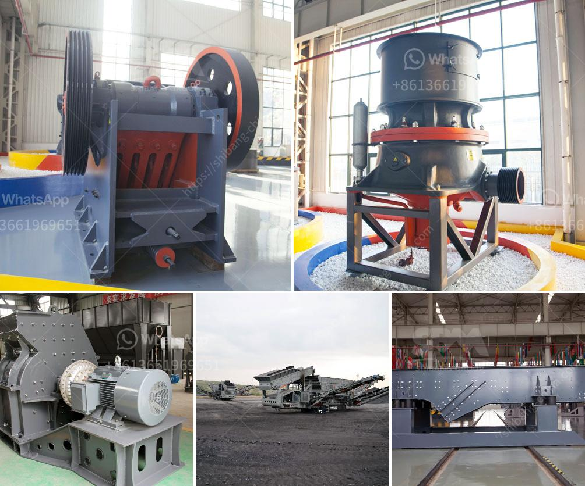

<h3>roller crusher machine manufacturer</h3>
A roller crusher machine is a heavy-duty machine used in construction, mining, and various industries. These machines come with a series of two rollers, which are used for determining the maximum permissible size of the material that can be fed into the machine. However, there are various factors that need to be considered before choosing a suitable roller crusher machine manufacturer.

One of the crucial aspects to look for in a manufacturer is the quality of their machines. It is vital to select a manufacturer with a good reputation for producing high-quality roller crushers. A premium quality machine will not only provide reliable performance but also require fewer repairs and maintenance, ensuring a longer lifespan.

Additionally, a reputable manufacturer will emphasize the use of high-grade materials for constructing their machines. The use of superior quality materials enhances the durability and strength of the machine, making it capable of withstanding heavy-duty operations. To ensure the quality of the materials used, manufacturers often undergo strict quality control measures and adhere to international standards and certifications.

Efficiency is another essential aspect to consider when selecting a roller crusher machine manufacturer. A well-designed machine will offer high efficiency, enabling faster and more effective crushing of materials. This can lead to increased productivity and lower operational costs in the long run. It is advisable to choose a manufacturer that invests in research and development to constantly improve the efficiency of their machines.

Another factor to consider is the availability of spare parts and after-sales service. Opting for a manufacturer that provides excellent after-sales service ensures timely assistance and support in case of any issues or breakdowns. Moreover, a manufacturer that offers readily available spare parts saves time and money on maintenance and repairs.

A roller crusher machine manufacturer should also provide customization options to cater to the specific needs of their customers. Different industries may require specific modifications or features in the machine to optimize its functionality. A manufacturer that offers custom-built machines ensures that customers get a product tailored to their unique requirements.

Furthermore, it is crucial to consider the cost-effectiveness of the roller crusher machine. While it is important to invest in a high-quality machine, it should also provide value for money. Comparing prices among different manufacturers and considering the overall features and benefits provided by the machine is essential to make an informed decision.

Lastly, a reputable manufacturer will have a strong customer base and positive reviews and testimonials from satisfied customers. Researching and reading reviews about different manufacturers can provide valuable insights into their reputation and the overall quality of their machines.

In conclusion, when looking for a roller crusher machine manufacturer, it is essential to prioritize quality, efficiency, availability of spare parts and after-sales service, customization options, and cost-effectiveness. Considering these factors and conducting thorough research will help in selecting a manufacturer that produces reliable, durable, and high-performing roller crusher machines.
<h3>Contact us</h3><ul><li><strong>Whatsapp:&nbsp;<a href="https://wa.me/8613661969651">+8613661969651</a></strong></li><li><a href="https://swt.shibang-china.com/?git&amp;zhl&amp;roller crusher machine manufacturer"><strong>Online Service(chat now)</strong></a></li></ul><h3>Related</h3><ul><li><a href='professional granite cone crusher.md'>professional granite cone crusher</a></li><li><a href='used stone crusher plant for sale andhra pradesh.md'>used stone crusher plant for sale andhra pradesh</a></li><li><a href='jaw crusher in dar es salaam.md'>jaw crusher in dar es salaam</a></li><li><a href='portable gold ore crusher.md'>portable gold ore crusher</a></li><li><a href='profitable cement plant for sale in tamilnadu.md'>profitable cement plant for sale in tamilnadu</a></li></ul>