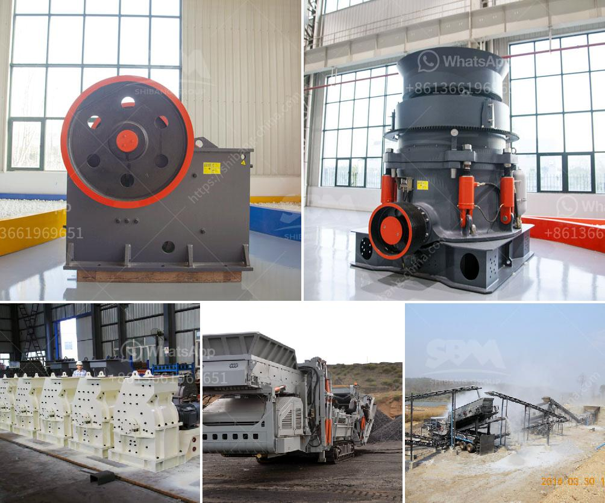

<h3>roller mill cement price</h3>
In recent years, roller mill cement price has gained significant attention in the construction industry due to its cost-effective and sustainable features. Roller mill cement is a finely powdered material used as a binder in construction projects. It is particularly known for its high strength and durability, making it an ideal choice for various construction applications.

One of the major advantages of roller mill cement is its affordable price. Compared to other types of cement, roller mill cement is relatively cheaper, making it a popular choice among construction professionals. This cost-effective solution allows contractors and builders to save money without compromising the quality of their projects.

Furthermore, roller mill cement offers excellent workability, enabling easy and efficient construction processes. Its fine particles and uniform composition contribute to better mixing and bonding, resulting in smooth and sturdy structures. This feature is particularly beneficial for construction projects that require precision and accuracy.

Another significant aspect of roller mill cement is its sustainable nature. With the ever-growing concern for environmental conservation, roller mill cement stands out as an eco-friendly alternative. It reduces the carbon footprint associated with traditional cement production methods, making it a more sustainable choice for construction projects.

Moreover, roller mill cement is known for its high performance and long-lasting characteristics. Its superior strength and durability make it capable of withstanding harsh weather conditions, pressure, and erosion. This makes it an ideal choice for infrastructure projects such as bridges, roads, and dams, where longevity and resilience are crucial.

In conclusion, roller mill cement price offers various advantages that make it an attractive option for the construction industry. Its cost-effectiveness, workability, sustainability, and durability make it a go-to choice for builders and contractors. When considering construction materials, roller mill cement is a reliable and efficient solution that ensures high-quality results without breaking the bank.
<h3>Contact us</h3><ul><li><strong>Whatsapp:&nbsp;<a href="https://wa.me/8613661969651">+8613661969651</a></strong></li><li><a href="https://swt.shibang-china.com/?git&amp;zhl&amp;roller mill cement price"><strong>Online Service(chat now)</strong></a></li></ul><h3>Related</h3><ul><li><a href='nigeria raymond mill.md'>nigeria raymond mill</a></li><li><a href='mobile crushing price uk.md'>mobile crushing price uk</a></li><li><a href='stone crusher supplier company.md'>stone crusher supplier company</a></li><li><a href='crusher equipment manufacturer.md'>crusher equipment manufacturer</a></li><li><a href='ball mill capacity of tons.md'>ball mill capacity of tons</a></li></ul>