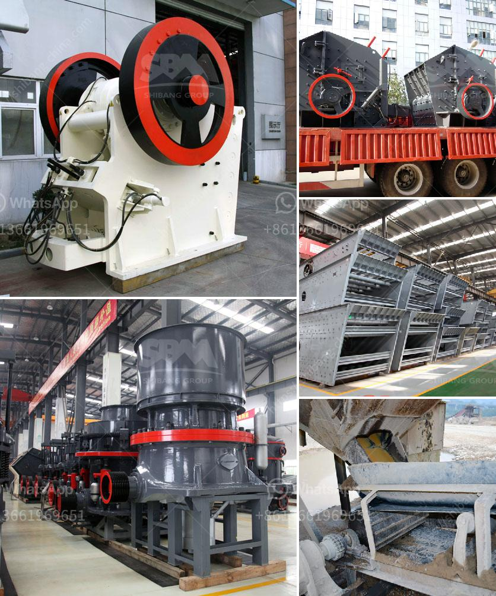

<h3>roller mill china</h3>
Roller mills, also known as vertical mills, have been extensively used in the cement industry for many years to grind and dry raw materials for cement production. Nowadays, roller mills are widely used in various industries, including mining, metallurgy, chemical engineering, construction, etc., to process different materials and products.

China, as the world's largest producer and consumer of cement, has been at the forefront of roller mill manufacturing. Leading manufacturers in China have developed their own proprietary roller mill technologies and have been supplying these state-of-the-art machines to both domestic and international markets.

One of the key advantages of roller mills is their ability to produce a finer and more uniform product compared to traditional ball mills. This is because the grinding principle of roller mills involves compression and shearing forces, which result in a more efficient comminution process. Additionally, roller mills offer a higher drying capacity, allowing for the processing of materials with higher moisture content.

Chinese roller mill manufacturers have made continuous advancements to improve the performance and efficiency of their machines. Their roller mills are equipped with advanced control systems, such as automatic control of material feed and product discharge, as well as real-time monitoring of key operating parameters. These features enable operators to optimize the grinding process, resulting in higher productivity and energy efficiency.

China's roller mill manufacturers also prioritize environmental sustainability in their designs. Roller mills are often integrated with waste heat recovery systems, which utilize the waste heat generated during the grinding process to generate electricity or heat for other applications. This not only reduces energy consumption but also minimizes greenhouse gas emissions.

In addition to their technical capabilities, Chinese roller mill manufacturers offer comprehensive customer support services. They provide installation and commissioning services, as well as training programs for operators to ensure the proper operation and maintenance of their machines. Prompt after-sales support and spare parts supply are also readily available to minimize production downtime.

The roller mill industry in China has made significant contributions to the development and advancement of grinding technology. Chinese manufacturers have elevated roller mills to a level where they have become indispensable equipment in many industrial sectors. Furthermore, their products have gained international recognition and have been exported to various countries around the world.

To conclude, roller mills are an essential part of modern industrial processes, offering superior grinding and drying capabilities. Chinese roller mill manufacturers have played a pivotal role in advancing the technology of roller mills, making them more efficient, environmentally friendly, and reliable. Going forward, China is expected to continue to be a prominent player in the roller mill industry, driving further innovation and growth in this sector.
<h3>Contact us</h3><ul><li><strong>Whatsapp:&nbsp;<a href="https://wa.me/8613661969651">+8613661969651</a></strong></li><li><a href="https://swt.shibang-china.com/?git&amp;zhl&amp;roller mill china"><strong>Online Service(chat now)</strong></a></li></ul><h3>Related</h3><ul><li><a href='indonesia coal crusher stamler agent.md'>indonesia coal crusher stamler agent</a></li><li><a href='talc ball mills south africa.md'>talc ball mills south africa</a></li><li><a href='project report of grinding mill.md'>project report of grinding mill</a></li><li><a href='iron ore mines equipments.md'>iron ore mines equipments</a></li><li><a href='philippine crushing machine.md'>philippine crushing machine</a></li></ul>