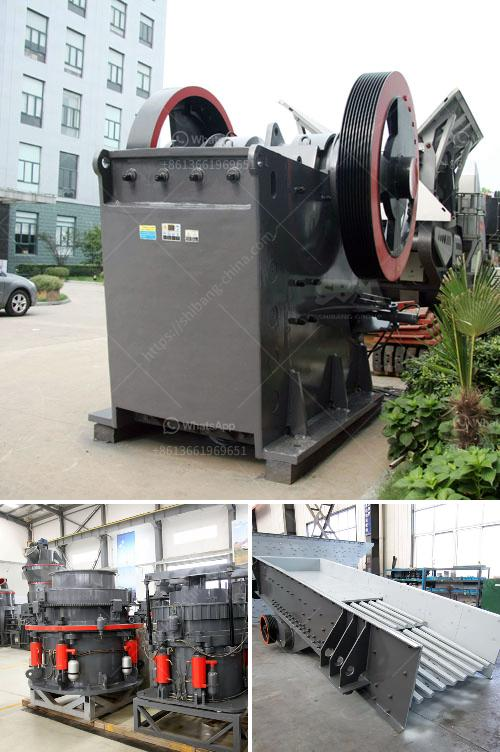

<h3>roller mill for ares</h3>
Roller milling is a widely used method in the agricultural industry for grinding grains and producing flour. This efficient process helps manufacturers produce high-quality flour that meets the demands and needs of consumers. The roller mill, also known as a milling machine, is a key component of this process, utilizing cylindrical rollers to crush and grind grain.

The concept of roller milling dates back to the 19th century when it was first introduced as an improvement over traditional stone grinding mills. The development of roller mills revolutionized the milling industry, making it more efficient, faster, and capable of producing a consistent and uniform product.

The key advantage of roller mills is their ability to process large volumes of grain quickly while achieving the desired particle size. The grain is fed through a hopper onto a pair of rotating rollers. These rollers can either be corrugated, providing a shearing action, or smooth, exerting a crushing force to break down the grain. As the grain passes through the gap between the rollers, it is ground into smaller particles. The adjustable gap between the rollers allows for precise control over the final grind size.

One of the main benefits of roller milling is the improved hygiene and sanitation of the process compared to stone grinding mills. Traditional stone mills, although effective, can accumulate contaminants and residues over time, impacting the quality and purity of the flour. In contrast, roller mills are made of smooth and non-porous materials, reducing the risk of contamination and ensuring a cleaner end product.

Another advantage of roller mills is their versatility in handling various types of grains and materials. They can process a wide range of cereals, including wheat, corn, barley, oats, and rice. Roller mills can also be used to grind non-cereal products such as legumes, beans, and oilseeds. The ability to adapt to different raw materials makes roller milling suitable for diverse applications, from commercial flour production to animal feed manufacturing.

Moreover, roller milling offers a more energy-efficient process compared to other grinding methods. The design of roller mills optimizes the use of power, reducing energy consumption while maintaining high milling efficiency. This energy efficiency translates into significant cost savings for manufacturers and promotes a more sustainable approach to grain processing.

The advancements in technology have further enhanced the performance and efficiency of roller mills. Automated control systems and digital sensors allow for precise monitoring and adjustment of the milling process, ensuring consistent quality and minimizing waste. Furthermore, modern roller mills are equipped with pneumatic systems for grain handling, reducing manual labor and improving operational safety.

In conclusion, roller mills are a crucial component of the milling industry, allowing for efficient and reliable grinding of grains and production of high-quality flour. Their ability to process large volumes of grain quickly and achieve consistent particle size makes them indispensable in commercial flour production. With the advancements in technology, roller mills continue to evolve, further improving their efficiency, hygiene, and versatility. As the demand for quality flour continues to grow, roller milling will undoubtedly remain a fundamental process in the food and agricultural industries.
<h3>Contact us</h3><ul><li><strong>Whatsapp:&nbsp;<a href="https://wa.me/8613661969651">+8613661969651</a></strong></li><li><a href="https://swt.shibang-china.com/?git&amp;zhl&amp;roller mill for ares"><strong>Online Service(chat now)</strong></a></li></ul><h3>Related</h3><ul><li><a href='cost of setting up a mini cement plant in india.md'>cost of setting up a mini cement plant in india</a></li><li><a href='raymond mill for limestone supplier in india.md'>raymond mill for limestone supplier in india</a></li><li><a href='cconveyor belts class.md'>cconveyor belts class</a></li><li><a href='calcium carbonate grinder mill.md'>calcium carbonate grinder mill</a></li><li><a href='mobile crushing plant hire product.md'>mobile crushing plant hire product</a></li></ul>