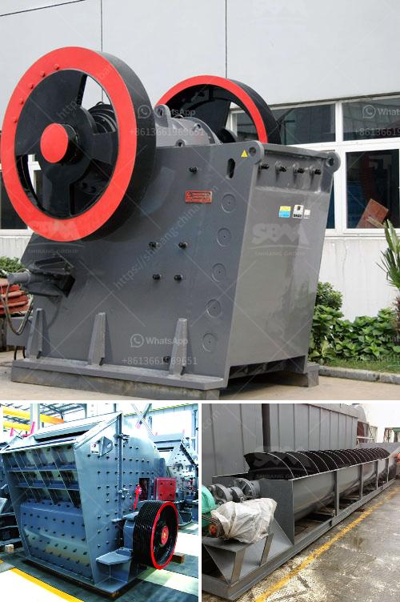

<h3>roller mill for mantles</h3>
When it comes to the production of mantles, a key component in the manufacturing of various products, it is essential to have reliable equipment that can ensure efficiency and high-quality end results. The roller mill has emerged as a popular choice in this realm, revolutionizing the mantle production process. With its unique capabilities and advanced technology, roller mills have proven to be a game-changer for manufacturers in numerous industries.

First and foremost, roller mills offer unmatched efficiency in the mantle production process. Traditional methods of manufacturing mantles often involve tedious manual labor, which can be time-consuming and labor-intensive. However, roller mills automate many of these processes, significantly reducing production time and resource requirements. The automated nature of the roller mill enables manufacturers to produce a larger quantity of mantles in a shorter period, translating into increased productivity and profitability.

Furthermore, roller mills excel in delivering consistent and accurate results, crucial in the manufacturing of mantles. These mills utilize precision engineering and advanced technology to ensure that the final product meets the required standards. The design of roller mills allows for precise control over variables such as thickness, composition, and finish, enabling manufacturers to produce mantles with uniformity and precision. The ability to maintain steady quality throughout the production process is a significant advantage that roller mills offer, ensuring customer satisfaction and enhancing the reputation of manufacturers.

In addition to efficiency and quality, roller mills also provide manufacturers with versatility in mantle production. These mills can accommodate a wide range of materials, including metals, ceramics, and even synthetic compounds. This flexibility allows manufacturers to explore different options and experiment with materials to create mantles that meet specific requirements and applications. The ability to adapt to various materials and customize production processes according to specific needs is a significant advantage that roller mills bring to the table.

Another noteworthy aspect of roller mills is their cost-effectiveness. While the initial investment in roller mills may seem substantial, their long-term benefits far outweigh the costs. The increased efficiency and productivity reduce overall production expenses in the long run, allowing manufacturers to maximize their profits. Moreover, the precision and consistency offered by roller mills minimize material waste, further reducing costs and optimizing resource utilization.

Roller mills for mantles have revolutionized the manufacturing landscape, making the production process faster, more accurate, and more efficient. By automating and optimizing key steps, these mills empower manufacturers to meet increasing demands while maintaining high-quality standards. Additionally, roller mills provide manufacturers with the flexibility to experiment with various materials, enabling innovation and customization.

In conclusion, roller mills have emerged as the go-to choice for mantle production due to their unparalleled efficiency, quality control capabilities, versatility, and cost-effectiveness. As technology continues to advance, we can only expect further enhancements in roller mill designs and functionalities. Manufacturers who invest in this cutting-edge equipment can stay ahead of the competition, delivering top-notch mantles to meet the evolving needs of their customers.
<h3>Contact us</h3><ul><li><strong>Whatsapp:&nbsp;<a href="https://wa.me/8613661969651">+8613661969651</a></strong></li><li><a href="https://swt.shibang-china.com/?git&amp;zhl&amp;roller mill for mantles"><strong>Online Service(chat now)</strong></a></li></ul><h3>Related</h3><ul><li><a href='stone mill grinder for sale.md'>stone mill grinder for sale</a></li><li><a href='talc ball mills south africa.md'>talc ball mills south africa</a></li><li><a href='prices of stone crusher.md'>prices of stone crusher</a></li><li><a href='diamond mining jaw crusher.md'>diamond mining jaw crusher</a></li><li><a href='hammer mill for ldpe grinding.md'>hammer mill for ldpe grinding</a></li></ul>