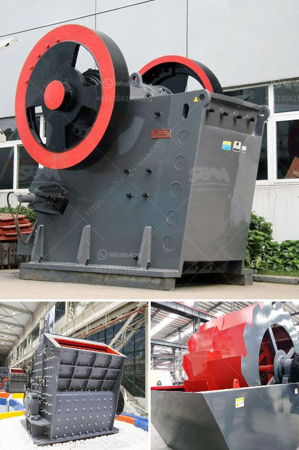

<h3>roller mill for onions</h3>
Farmers around the world rely heavily on the use of equipment to maximize their productivity and consistently deliver high-quality produce to the market. In the onion industry, one such machine that has revolutionized the way onions are processed is the roller mill. This incredibly efficient tool has transformed onion handling and processing by streamlining operations and improving overall product quality.

A roller mill is a specialized machine designed to finely grind onions into various sizes, enabling easier handling, storage, and reducing waste. The machine consists of a series of horizontally arranged rollers, each equipped with sharp blades or teeth. As onions pass through the rollers, the blades slice them into uniform pieces, minimizing the chance of bruising or damage. This careful cutting process ensures that the onions retain their freshness and flavor, providing consumers with a high-quality product.

One of the key advantages of using a roller mill for onions is the enhanced efficiency it offers. Previously, farmers had to process onions manually or hire manual laborers to chop them into desired sizes. This often resulted in inconsistent cutting, which affected the overall appearance and quality of the final product. With roller mills, however, farmers can process large quantities of onions in a short amount of time, significantly reducing processing time and labor costs.

Furthermore, roller mills are known for their ability to handle different sizes of onions. Whether small or large, a roller mill can effortlessly process onions of varying diameters, ensuring a consistent product output. This versatility allows farmers to cater to the diverse demands of the market, catering to different customer preferences and needs. Additionally, roller mills can be adjusted to produce diced, sliced, or crushed onions, giving farmers the freedom to customize their products according to market demands.

In addition to streamlining operations and improving efficiency, the roller mill also contributes to reducing waste. By precisely cutting the onions, the roller mill minimizes unnecessary trimming and waste material. This not only ensures maximum utilization of the produce but also reduces the environmental impact associated with excessive waste disposal.

Furthermore, using a roller mill for onions also plays a significant role in maintaining food safety and hygiene. Traditional methods of processing onions often involve numerous manual interactions, increasing the risk of contamination. Roller mills, on the other hand, provide an automated and enclosed system, minimizing the chances of microbial growth or cross-contamination. This ultimately leads to safer and healthier products for consumers.

In conclusion, the roller mill has revolutionized the onion industry by improving the efficiency and quality of onion processing. Farmers can now process large quantities of onions quickly, resulting in higher productivity and reduced labor costs. With the ability to handle different onion sizes and customize the final product, roller mills offer the flexibility needed to meet market demands. Moreover, by reducing waste, ensuring food safety, and maintaining high-quality output, roller mills make an invaluable contribution to the onion industry as a whole. With such significant benefits, it's no wonder that roller mills have become an indispensable tool for onion farmers worldwide.
<h3>Contact us</h3><ul><li><strong>Whatsapp:&nbsp;<a href="https://wa.me/8613661969651">+8613661969651</a></strong></li><li><a href="https://swt.shibang-china.com/?git&amp;zhl&amp;roller mill for onions"><strong>Online Service(chat now)</strong></a></li></ul><h3>Related</h3><ul><li><a href='quarry machine manfacturer.md'>quarry machine manfacturer</a></li><li><a href='calcium roller mill.md'>calcium roller mill</a></li><li><a href='iron crushing machine.md'>iron crushing machine</a></li><li><a href='febcoal coal mining plant in ethiopia.md'>febcoal coal mining plant in ethiopia</a></li><li><a href='vertical roller mill industrial.md'>vertical roller mill industrial</a></li></ul>