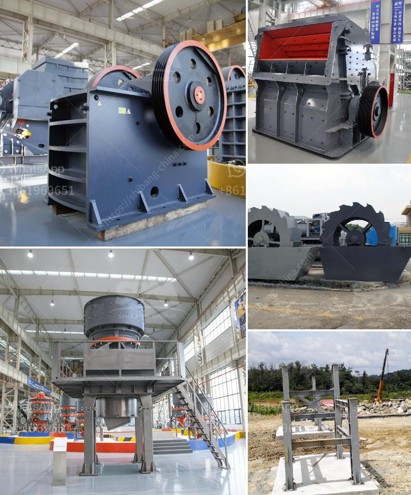

<h3>roller mill for ore</h3>
Roller mills are a type of machinery used for ore processing and grinding. This equipment is essential in the process of reducing large chunks of ore into smaller pieces, facilitating the extraction of valuable minerals. 

The roller mill operates by extracting the ore from a hopper, where it is fed into a set of rollers that crush, grind, and separate it into different components. These components can include valuable minerals such as gold, silver, copper, and iron. The crushed ore is then further processed, either through flotation, leaching, or another method, to extract the desired minerals.

One significant advantage of using roller mills for ore processing is their ability to handle large quantities of ore. A roller mill can process several tons of ore per hour, making them highly efficient in large-scale mining operations. Additionally, the use of roller mills minimizes the need for multiple pieces of equipment, reducing costs and improving productivity.

Another benefit of roller mills is their versatility. They can accommodate different types of ore, including those with varying hardness and abrasiveness. This flexibility allows mining companies to process diverse materials effectively.

Furthermore, roller mills offer improved control over the grinding process. By adjusting the roller speed or gap, the size of the final product can be easily regulated, ensuring that it meets specific requirements. This precision in grinding also helps optimize the extraction of valuable minerals from the ore.

In conclusion, roller mills play a vital role in the ore processing industry. Their ability to handle large quantities of ore, versatility, and precise grinding control make them a valuable asset for mining companies. With their help, the extraction of valuable minerals becomes more efficient and cost-effective. As technology continues to advance, roller mills will likely continue to evolve, further enhancing their functionality and performance in the mining sector.
<h3>Contact us</h3><ul><li><strong>Whatsapp:&nbsp;<a href="https://wa.me/8613661969651">+8613661969651</a></strong></li><li><a href="https://swt.shibang-china.com/?git&amp;zhl&amp;roller mill for ore"><strong>Online Service(chat now)</strong></a></li></ul><h3>Related</h3><ul><li><a href='crusher and screening plants for sale.md'>crusher and screening plants for sale</a></li><li><a href='cost of graphite beneficiation plant.md'>cost of graphite beneficiation plant</a></li><li><a href='clay brick making machine zimbabwe.md'>clay brick making machine zimbabwe</a></li><li><a href='ball mill design calculation.md'>ball mill design calculation</a></li><li><a href='ulltra fine grinding mill.md'>ulltra fine grinding mill</a></li></ul>