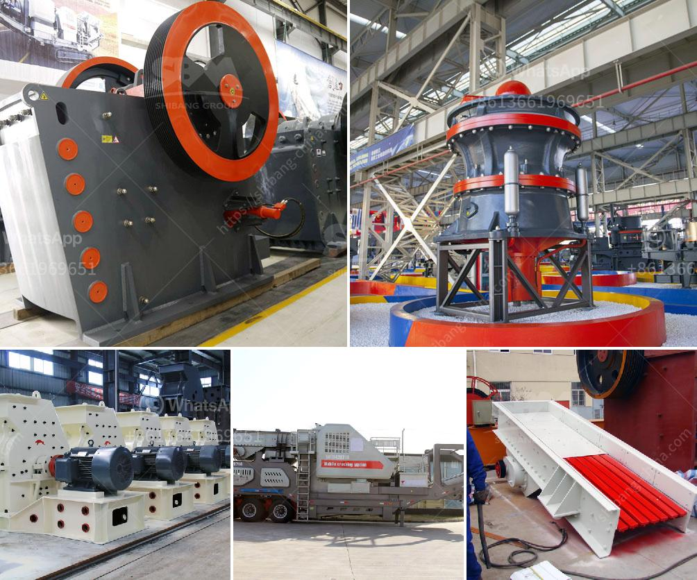

<h3>roller mill grinder</h3>
A roller mill grinder is a mechanical grinding device that utilizes cylindrical rollers to crush and grind material into a fine powder. Roller mill grinders are widely used in the food, mining, pharmaceutical, and agricultural industries. They provide a versatile and efficient grinding solution for a variety of materials, making them an essential tool in many production processes.

One of the key benefits of roller mill grinders is their ability to produce uniform and consistent particle size distributions. This is achieved through the use of multiple rollers that rotate at different speeds, effectively crushing and grinding the material between them. The adjustable gap between the rollers allows for precise control over the final particle size, ensuring that the desired specifications are met.

Another advantage of roller mill grinders is their high grinding efficiency. The cylindrical shape of the rollers and the large surface area they provide allow for a larger volume of material to be processed at once. This means that more material can be ground in a shorter amount of time, increasing productivity and reducing energy consumption.

In addition to their grinding capabilities, roller mill grinders are also known for their reliability and durability. The rollers are typically made of hardened steel or cast iron, which can withstand the high pressure and abrasive forces generated during the grinding process. This ensures that the grinder can handle tough and demanding materials without wearing out quickly.

Furthermore, roller mill grinders offer easy maintenance and operation. Most models feature a simple design with few moving parts, making them easy to clean and maintain. They also have a user-friendly interface that allows for easy adjustment of the grinding parameters, such as roller speed and gap size. This enables operators to quickly and accurately fine-tune the grinding process to achieve the desired results.

The versatility of roller mill grinders is another reason why they are favored in various industries. They can effectively grind a wide range of materials, including grains, herbs, spices, and even hard minerals. This makes them suitable for applications such as flour milling, coffee grinding, pharmaceutical production, and mineral processing.

Roller mill grinders are available in different sizes and configurations to suit the specific needs of different industries. Small-scale models are ideal for laboratory and pilot-scale testing, while larger industrial-grade mills are capable of handling large volumes of material. They can be equipped with additional features such as automatic feeding systems, dust collection, and temperature control to further enhance their performance.

In conclusion, roller mill grinders are a versatile and efficient grinding solution that offers numerous advantages over traditional grinding methods. Their ability to produce uniform particle size distributions, high grinding efficiency, and reliable performance make them a valuable tool in many industries. Whether it's grinding grains, spices, or minerals, roller mill grinders provide a reliable and cost-effective solution for all your grinding needs.
<h3>Contact us</h3><ul><li><strong>Whatsapp:&nbsp;<a href="https://wa.me/8613661969651">+8613661969651</a></strong></li><li><a href="https://swt.shibang-china.com/?git&amp;zhl&amp;roller mill grinder"><strong>Online Service(chat now)</strong></a></li></ul><h3>Related</h3><ul><li><a href='price of medium quarry plant.md'>price of medium quarry plant</a></li><li><a href='vertical coal mill single diagram.md'>vertical coal mill single diagram</a></li><li><a href='advances in hammer mills.md'>advances in hammer mills</a></li><li><a href='roller crusher discount.md'>roller crusher discount</a></li><li><a href='indian river sand grinding machine price.md'>indian river sand grinding machine price</a></li></ul>