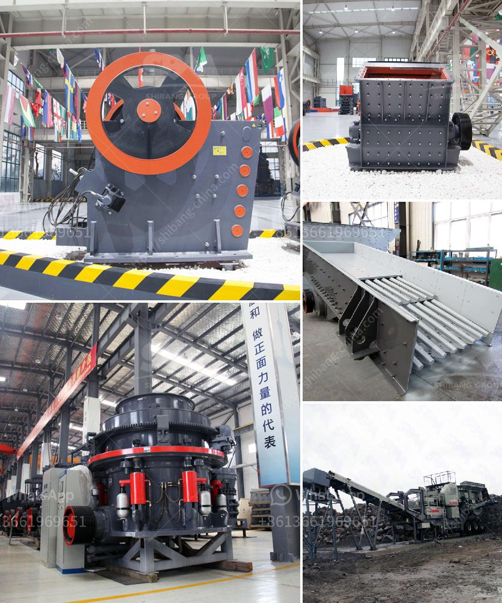

<h3>roller mill pulverizer ofto 5 tons per hour price</h3>
Grinding is an essential process in many industries, especially in the food, chemical, and pharmaceutical sectors. To achieve the desired particle size, various types of grinding equipment are used. Among them, roller mill pulverizers have gained significant popularity due to their high efficiency and cost-effectiveness. In this article, we will explore the roller mill pulverizer, its capabilities, and the factors that influence its price.

A roller mill pulverizer, also known as a mill, is a versatile grinding device that employs cylindrical rollers to crush and grind material. These rollers rotate at different speeds and exert a force on the material being processed. This force breaks down large particles into smaller, more manageable sizes. The result is a fine powder or granular material that can be used in various applications.

One of the major advantages of using a roller mill pulverizer is its high grinding efficiency. With a well-designed system, it can produce large quantities of finely ground material in a short period. This high production rate makes it highly suitable for applications requiring large volumes of processed material. Moreover, the roller mill pulverizer can achieve a narrow particle size distribution, ensuring consistent quality and uniformity in the final product.

Another significant benefit of the roller mill pulverizer is its versatility. It can handle a wide range of materials, including minerals, chemicals, and even heat-sensitive compounds. This property makes it an ideal choice for industries that deal with multiple types of products. Additionally, roller mills can be customized to meet specific processing requirements, enabling different options for grinding and separating the final product.

When considering the price of a roller mill pulverizer, several factors come into play. Firstly, the size and capacity of the pulverizer determine the overall cost. Larger machines with higher production rates will generally cost more than smaller ones. Additionally, the materials used in the construction of the pulverizer, such as the type of metal, also influence the price. High-quality materials result in a durable and efficient machine, but may incur a higher cost.

Furthermore, the level of automation and control systems integrated into the roller mill pulverizer can affect its price. Advanced features like automated feeding, monitoring, and regulation of grinding parameters can enhance the performance and productivity of the pulverizer but may add to its overall cost. However, such features can result in significant savings in terms of labor and maintenance costs in the long run.

In conclusion, roller mill pulverizers offer an efficient and versatile solution for grinding and pulverizing a wide range of materials. Their high production rates and excellent particle size control make them indispensable in various industries. When considering the price of a roller mill pulverizer, factors such as size, capacity, materials used, and level of automation should be taken into account. Investing in a roller mill pulverizer can result in significant cost savings and improved productivity, making it a valuable asset for any manufacturing facility.
<h3>Contact us</h3><ul><li><strong>Whatsapp:&nbsp;<a href="https://wa.me/8613661969651">+8613661969651</a></strong></li><li><a href="https://swt.shibang-china.com/?git&amp;zhl&amp;roller mill pulverizer ofto 5 tons per hour price"><strong>Online Service(chat now)</strong></a></li></ul><h3>Related</h3><ul><li><a href='cost to setup cement plant industry.md'>cost to setup cement plant industry</a></li><li><a href='price crusher mill price stone crusher.md'>price crusher mill price stone crusher</a></li><li><a href='list of quarrying companies in the philippines.md'>list of quarrying companies in the philippines</a></li><li><a href='quarry equipment for sale in south africa.md'>quarry equipment for sale in south africa</a></li><li><a href='roller mill for mantles.md'>roller mill for mantles</a></li></ul>