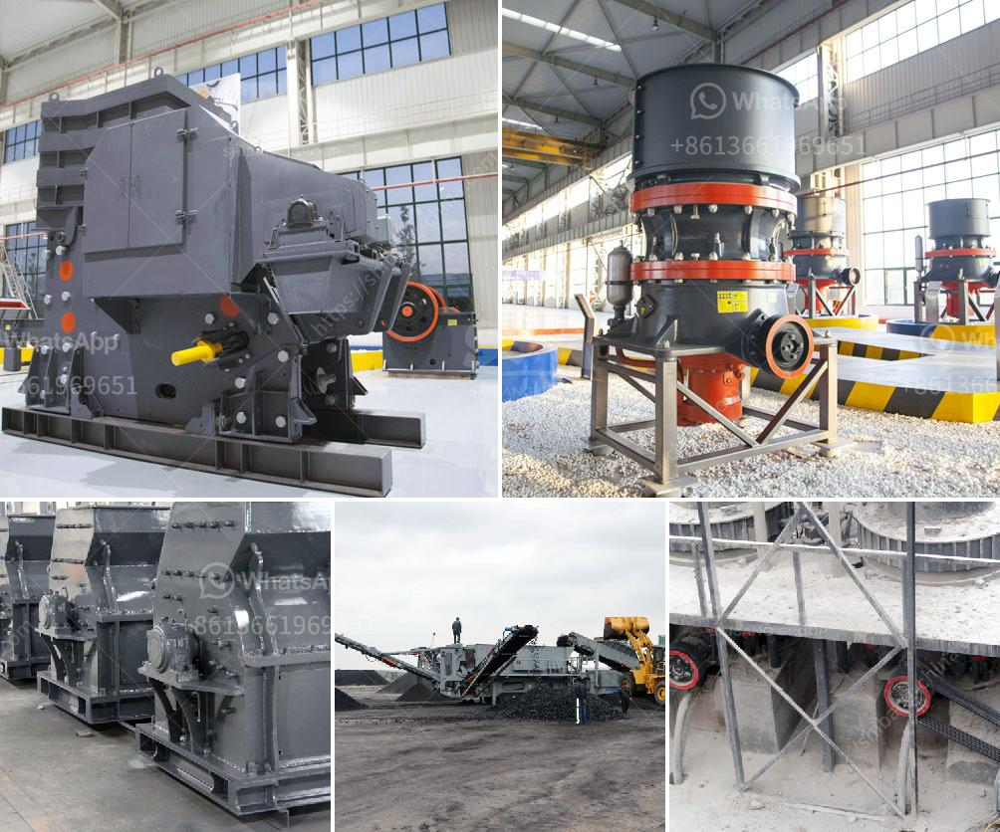

<h3>rotary breaker for coal 200tph</h3>
Coal is a vital resource in the energy industry, providing a significant proportion of the world's electricity. To efficiently utilize coal and optimize its combustion, it needs to be processed and sized properly. One of the essential equipment in this process is a rotary breaker.

A rotary breaker, also known as a rotary crusher, is a type of secondary crushing machine used for coal processing operations. It is mainly used to crush raw coal between advancing and retreating horizons, breaking it into lumps of a desired size. Unlike ordinary hammer mills, a rotary breaker works on the principle of attrition, reducing the coal size through repeated impact between rotating hammers and the coal material.

The advantages of using a rotary breaker for coal processing are numerous. Firstly, it effectively separates impurities from coal, ensuring a cleaner and higher-quality final product. This is particularly important when coal is used for power generation, as impurities can adversely affect the combustion process and increase emissions.

Secondly, the rotary breaker also helps in reducing the overall size of coal, making it easier to handle and transport. The coal lumps produced by the breaker have a uniform size distribution, allowing for efficient feeding and combustion in boilers. Additionally, the smaller coal size maximizes the surface area exposed to combustion air, resulting in better thermal efficiency.

Furthermore, the rotary breaker is highly customizable, allowing operators to control the size output based on their specific needs. This adaptability makes it suitable for various coal types and ensures optimal coal utilization in different applications.

Lastly, a rotary breaker is known for its robust construction and low maintenance requirements. It is designed to handle large capacities of coal without clogging or frequent breakdowns, minimizing downtime and maximizing production efficiency.

In conclusion, a rotary breaker plays a crucial role in the coal processing industry by efficiently sizing and cleaning coal for various applications. Its ability to remove impurities, reduce coal size, and provide customizable output make it a reliable and cost-effective solution. As the world continues to rely on coal as an energy source, rotary breakers will continue to play a vital role in coal processing operations.
<h3>Contact us</h3><ul><li><strong>Whatsapp:&nbsp;<a href="https://wa.me/8613661969651">+8613661969651</a></strong></li><li><a href="https://swt.shibang-china.com/?git&amp;zhl&amp;rotary breaker for coal 200tph"><strong>Online Service(chat now)</strong></a></li></ul><h3>Related</h3><ul><li><a href='stone crusher in oman.md'>stone crusher in oman</a></li><li><a href='mineral grinding corporation.md'>mineral grinding corporation</a></li><li><a href='three ring micro powder mill.md'>three ring micro powder mill</a></li><li><a href='quartz stone production line machinery.md'>quartz stone production line machinery</a></li><li><a href='tonnes per year cement plant machinary.md'>tonnes per year cement plant machinary</a></li></ul>