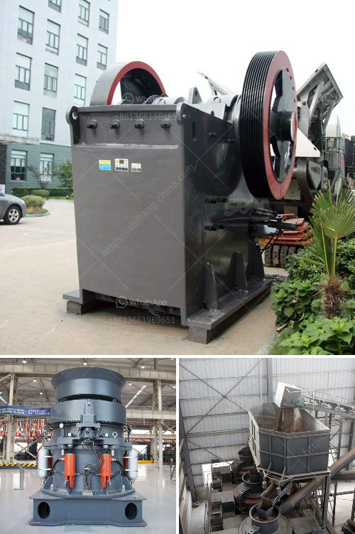

<h3>rotary crusher manufacturer</h3>
In the mining industry, a crusher is a necessary equipment. When it comes to purchasing one, there are several options to choose from, such as impact crushers, jaw crushers, and cone crushers. However, one type of crusher stands out from the rest due to its distinct advantages – the rotary crusher.

A rotary crusher, also known as a rotary breaker, is used to break down oversize rocks and other materials in the mining process. It consists of a large, rotating drum that moves and crushes the material against a fixed impact plate. The rotating motion of the drum ensures efficient crushing and breaks down the material into smaller, more manageable sizes.

One of the key players in manufacturing rotary crushers is XYZ Crusher Co., Ltd. With years of experience in the industry, XYZ Crusher has earned a reputation for producing high-quality and reliable equipment that has revolutionized the mining industry.

One of the major advantages of rotary crushers manufactured by XYZ Crusher is their versatility. These crushers can handle a wide range of materials, from coal and limestone to iron ore and bauxite. This versatility makes them suitable for various applications in different mining operations.

Another notable feature of XYZ Crusher's rotary crushers is their robust and durable construction. These crushers are designed to withstand the harsh conditions of the mining environment. The materials used, such as high-grade steel and alloy components, ensure long-lasting performance and minimal maintenance requirements.

In addition to their durability, rotary crushers manufactured by XYZ Crusher are also known for their high efficiency. The rotating motion of the drum, combined with the impact plate, creates a crushing action that efficiently breaks down the material. This results in higher productivity and reduced energy consumption compared to other types of crushers.

Furthermore, XYZ Crusher's rotary crushers are equipped with advanced safety features, ensuring a safe and reliable operation. These features include automatic tramp release systems, which protect the crusher from damage caused by oversize material, as well as hydraulic adjustment systems for easy and accurate control of the product size.

The commitment to customer satisfaction is another reason XYZ Crusher is a leading manufacturer of rotary crushers. They offer comprehensive after-sales support, including technical assistance, spare parts availability, and maintenance services. This ensures that customers can rely on their equipment for uninterrupted mining operations.

In conclusion, rotary crushers manufactured by XYZ Crusher Co., Ltd. have transformed the mining industry with their versatility, durability, efficiency, and safety features. With their wide range of applications and proven performance, these crushers have become a preferred choice for mining operators around the world. XYZ Crusher's commitment to customer satisfaction further cements their position as a leading manufacturer in the market. If you are in the mining industry and looking for a reliable and efficient crusher, look no further than XYZ Crusher's rotary crushers.
<h3>Contact us</h3><ul><li><strong>Whatsapp:&nbsp;<a href="https://wa.me/8613661969651">+8613661969651</a></strong></li><li><a href="https://swt.shibang-china.com/?git&amp;zhl&amp;rotary crusher manufacturer"><strong>Online Service(chat now)</strong></a></li></ul><h3>Related</h3><ul><li><a href='granite crushing plant in sri lanka.md'>granite crushing plant in sri lanka</a></li><li><a href='slag grinding problems.md'>slag grinding problems</a></li><li><a href='grinder mill bogota.md'>grinder mill bogota</a></li><li><a href='shell powder making machine grinding mill for sale.md'>shell powder making machine grinding mill for sale</a></li><li><a href='nigeria c125 jaw crusher.md'>nigeria c125 jaw crusher</a></li></ul>