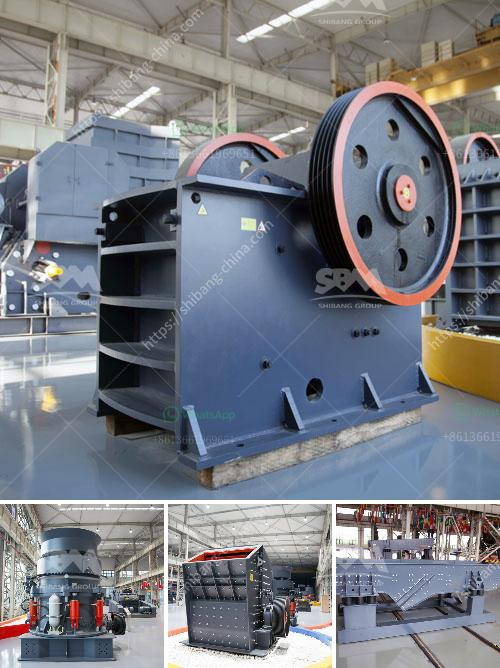

<h3>rotary dryer for sale in india</h3>
In today's fast-paced world, a reliable and efficient drying system is an essential component of any industrial process. Whether it's in the food, chemical, or mineral industries, the ability to remove moisture quickly and efficiently is crucial for optimal production. And this is where a rotary dryer comes into play.

A rotary dryer is a type of industrial drying equipment that utilizes rotational motion to mix and dry substances efficiently. It consists of a large, rotating cylindrical tube, known as the drum, with a concentric internal flighting system. As the material is fed into the dryer, it is lifted and cascaded by the flighting, allowing for even drying and effective heat transfer.

India, being a diverse and rapidly growing economy, has seen a significant surge in the demand for industrial dryers across various sectors. As a result, numerous manufacturers are now offering rotary dryers for sale in India, providing the market with advanced and cost-effective drying solutions.

One of the significant advantages of a rotary dryer is its versatility. It can handle a wide range of materials, from granular bulk solids to sticky paste-like substances. This adaptability makes it the preferred choice for drying various products, such as minerals, fertilizers, biomass, chemicals, and food items like grains and spices.

Additionally, rotary dryers are known for their energy-efficient performance. The design of the internal flighting system ensures maximum contact between the material and the hot gases, resulting in efficient heat transfer and reduced energy consumption. This not only helps businesses save on operational costs but also contributes to environmental sustainability.

Another key feature of rotary dryers is their ability to handle high moisture content. It is not uncommon for many industries in India to deal with materials containing excess moisture. With a rotary dryer, such materials can be easily processed, reducing the drying time significantly. As a result, industrial processes are streamlined, and productivity is enhanced.

Furthermore, the availability of rotary dryers for sale in India means that companies can now invest in high-quality drying equipment without having to rely on costly imports. Local manufacturers have stepped up to meet the growing demand, offering customizable and state-of-the-art designs tailored to specific industry requirements.

However, while there is a wide range of options available for rotary dryers in India, it is crucial to choose a reputable manufacturer. Consider factors such as experience, expertise, and after-sales service to ensure a reliable and long-lasting investment. Additionally, assessing the need for any specific features, such as temperature control or dust collection, will help in finding the most suitable dryer for a particular application.

In conclusion, the availability of rotary dryers for sale in India has revolutionized the drying process across various industries. The versatility, energy efficiency, and handling of high moisture content make these dryers the preferred choice for businesses in the country. As the demand for faster and more efficient drying solutions continues to grow, investing in a rotary dryer can help businesses stay ahead of the competition while achieving cost savings and environmental sustainability.
<h3>Contact us</h3><ul><li><strong>Whatsapp:&nbsp;<a href="https://wa.me/8613661969651">+8613661969651</a></strong></li><li><a href="https://swt.shibang-china.com/?git&amp;zhl&amp;rotary dryer for sale in india"><strong>Online Service(chat now)</strong></a></li></ul><h3>Related</h3><ul><li><a href='calcium carbonate plants in china.md'>calcium carbonate plants in china</a></li><li><a href='500 tone gypsum powder manufacture pant.md'>500 tone gypsum powder manufacture pant</a></li><li><a href='charcoal crusher kenya.md'>charcoal crusher kenya</a></li><li><a href='used concrete crushers for sale in ontario.md'>used concrete crushers for sale in ontario</a></li><li><a href='aggregate crushing process.md'>aggregate crushing process</a></li></ul>