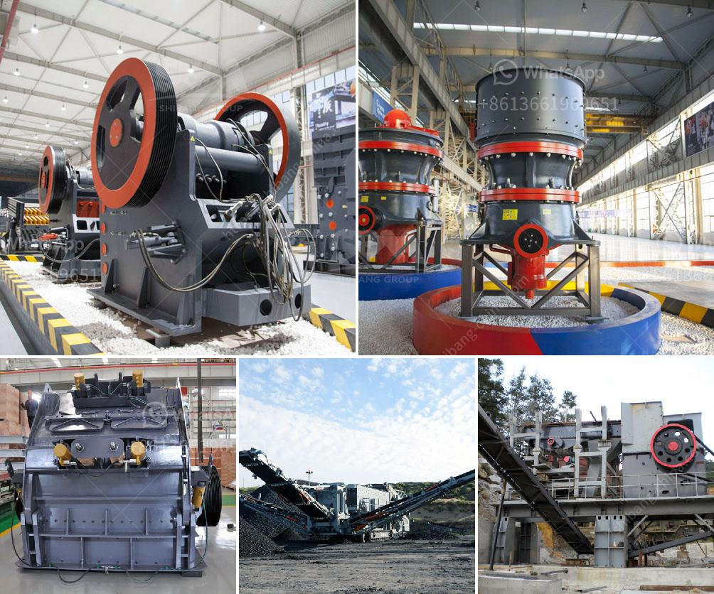

<h3>rubber latex processing ppt</h3>
Rubber latex processing plays a crucial role in the production of various rubber products. It involves several steps that transform the natural latex into a usable material for manufacturing purposes. A PowerPoint presentation (PPT) is an effective way to visually explain and demonstrate the rubber latex processing method, ensuring that all the essential details are covered.

The first step in rubber latex processing is the collection of latex from rubber trees. This is done by tapping the trees, which involves making a diagonal incision in the bark to allow the latex to flow into a collecting cup. The collected latex is then strained to remove impurities and transferred to large storage tanks.

The next stage is the preservation of the latex to prevent it from coagulating. This is typically achieved by adding chemicals such as ammonia or sodium bisulfite to stabilize the latex. The latex is then left to rest for a specific period to ensure complete preservation.

Once the latex is preserved, it undergoes a process called centrifugation. It involves spinning the latex at high speeds in a centrifuge machine to separate the solids from the liquid. This process helps to obtain a concentrated latex that is free from impurities.

After centrifugation, the latex is coagulated using various methods. One common method is to add an acid like formic or acetic acid to the latex, causing coagulation to occur rapidly. The coagulated latex is then processed through a series of presses or rollers to remove excess water and form a solid rubber sheet.

The last step in rubber latex processing is drying and curing, which involves exposing the rubber sheets to heat and steam. This process helps to remove any remaining moisture and improve the mechanical properties of the rubber. The cured rubber sheets can then be further processed into various rubber products like gloves, balloons, condoms, and more.

In conclusion, rubber latex processing is a crucial process in the production of rubber products. A well-designed PowerPoint presentation can effectively explain the different stages involved in processing rubber latex, from collection to the final curing process. This visual aid can be beneficial for both professionals working in the rubber industry and those interested in understanding the latex manufacturing process.
<h3>Contact us</h3><ul><li><strong>Whatsapp:&nbsp;<a href="https://wa.me/8613661969651">+8613661969651</a></strong></li><li><a href="https://swt.shibang-china.com/?git&amp;zhl&amp;rubber latex processing ppt"><strong>Online Service(chat now)</strong></a></li></ul><h3>Related</h3><ul><li><a href='iron ore processing plant in mexico.md'>iron ore processing plant in mexico</a></li><li><a href='barite beneficiation plant.md'>barite beneficiation plant</a></li><li><a href='gold ore rock processing equipment price.md'>gold ore rock processing equipment price</a></li><li><a href='calcium carbonate powder mill price.md'>calcium carbonate powder mill price</a></li><li><a href='hydraulic system loesche mill.md'>hydraulic system loesche mill</a></li></ul>