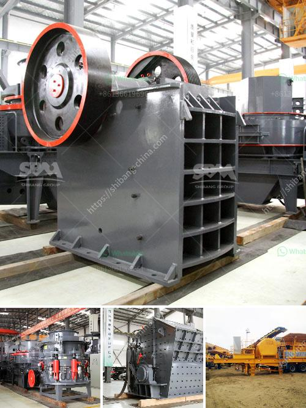

<h3>rubble recycling machine in china</h3>
In recent years, China has witnessed an exponential rise in its construction industry, resulting in a significant generation of construction and demolition waste, commonly known as rubble. However, instead of treating it as a burden, China has embraced an innovative approach by developing efficient rubble recycling machines. These cutting-edge technologies not only address the nation's waste management challenges but also contribute to sustainable development and the preservation of natural resources.

China's rapid urbanization and industrialization have led to a boom in the construction sector. While it has played a vital role in the nation's economic growth, this exponential expansion has also resulted in a huge volume of construction and demolition waste. According to China's Ministry of Housing and Urban-Rural Development, the country produced over 2.3 billion metric tons of construction waste in 2018 alone, and this number is expected to grow further in the coming years.

To address the mounting waste challenges, Chinese manufacturers have developed advanced rubble recycling machines. These innovative machines are specifically designed to pulverize, sort, and recycle construction waste, transforming it into valuable resources. The process involves feeding the rubble into the machine, where it is crushed, sorted to remove impurities, and transformed into reusable materials such as aggregates, sand, and bricks.

The introduction of rubble recycling machines has numerous benefits. Firstly, it significantly reduces the strain on landfills and diminishes pollution caused by waste disposal. By converting waste into reusable materials, these machines conserve natural resources and curb the need for extracting new raw materials. Moreover, it creates new business opportunities by generating employment and contributing to the circular economy. Additionally, reusing construction waste reduces the ecological footprint associated with mining and manufacturing new materials, ultimately leading to a more sustainable construction industry.

Recognizing the potential of rubble recycling machines, the Chinese government has been actively encouraging their widespread adoption. Policies and regulations have been put in place to promote the use of such machines and facilitate the recycling industry's growth. With continuous advancements in technology, it is expected that China's construction waste recycling rate will continue to rise, emphasizing the country's commitment to sustainable development and waste management.

China's emergence as a global leader in using rubble recycling machines illustrates its dedication to tackling waste management challenges while also promoting sustainable development. By recycling construction waste, China is not only contributing to waste reduction but also creating a more environmentally friendly construction sector, setting an example for other countries to follow.
<h3>Contact us</h3><ul><li><strong>Whatsapp:&nbsp;<a href="https://wa.me/8613661969651">+8613661969651</a></strong></li><li><a href="https://swt.shibang-china.com/?git&amp;zhl&amp;rubble recycling machine in china"><strong>Online Service(chat now)</strong></a></li></ul><h3>Related</h3><ul><li><a href='quarrying crusher machine.md'>quarrying crusher machine</a></li><li><a href='raymond mill for limestone supplier in india.md'>raymond mill for limestone supplier in india</a></li><li><a href='used crusher for sale in tanzania.md'>used crusher for sale in tanzania</a></li><li><a href='raymond roller mill drawings.md'>raymond roller mill drawings</a></li><li><a href='limestone crusher limestone crusher equipment.md'>limestone crusher limestone crusher equipment</a></li></ul>