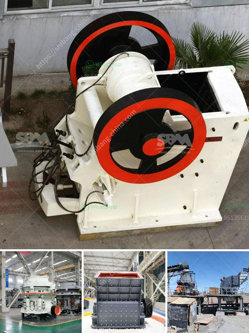

<h3>sag mill grinding ball</h3>
The sag mill grinding ball is an essential piece of equipment for the mining and mineral processing industry. The grinding ball is used to grind and crush the ore into small particles, which increases the surface area of the ore for further processing. In addition, the grinding ball aids in reducing the overall energy consumption in grinding operations.

The sag mill grinding ball is typically made of steel, which provides strength and durability to withstand the harsh working conditions of a mining operation. It is commonly used in the production of cement, silicate products, new building materials, refractory materials, fertilizers, black and non-ferrous metal beneficiation, and glass ceramics.

The sag mill grinding ball is designed with a smooth surface to facilitate efficient grinding. The smooth surface also helps to reduce wear and tear on both the grinding ball and the grinding media. This ensures a longer lifespan for the grinding ball, reducing the need for frequent replacement.

The sag mill grinding ball is available in different sizes and materials to suit various grinding applications. The size of the grinding ball is determined by the particle size required for the grinding process. Smaller grinding balls are used for finer grinding, while larger grinding balls are used for coarse grinding.

The material used to manufacture the grinding ball also affects its performance. Steel grinding balls are commonly used due to their high strength and durability. They can withstand the impact and wear caused by the grinding process, ensuring a longer lifespan. Other materials, such as ceramic or rubber, can be used for specific grinding applications that require a more delicate approach.

To ensure optimal performance, the sag mill grinding ball needs to have a high hardness. Hardness is measured on the Mohs scale, which ranges from 1 to 10. The grinding ball should have a hardness level of at least 60 on the scale to withstand the grinding process without losing its shape or efficiency.

The grinding ball also needs to have good impact resistance to withstand the high impacts exerted by the grinding media and the ore. This ensures that the grinding ball maintains its shape and efficiency, reducing the need for frequent replacements.

The sag mill grinding ball is an important component of the grinding circuit, contributing to its efficiency and overall performance. Choosing the right grinding ball size, material, and hardness is crucial for achieving optimal grinding results. Regular maintenance and inspections are also necessary to ensure the grinding ball continues to perform at its best.

In conclusion, the sag mill grinding ball is a critical component in the mining and mineral processing industry. Its role in grinding and crushing ore cannot be overlooked. By selecting the appropriate grinding ball size, material, and hardness, mining operations can optimize their grinding circuits, improve efficiency, and reduce energy consumption.
<h3>Contact us</h3><ul><li><strong>Whatsapp:&nbsp;<a href="https://wa.me/8613661969651">+8613661969651</a></strong></li><li><a href="https://swt.shibang-china.com/?git&amp;zhl&amp;sag mill grinding ball"><strong>Online Service(chat now)</strong></a></li></ul><h3>Related</h3><ul><li><a href='limestone jaw crushers.md'>limestone jaw crushers</a></li><li><a href='used coal washing plant sale.md'>used coal washing plant sale</a></li><li><a href='calcium carbonate plants in china.md'>calcium carbonate plants in china</a></li><li><a href='modular mineral processing plant.md'>modular mineral processing plant</a></li><li><a href='ballast crusher for sale.md'>ballast crusher for sale</a></li></ul>