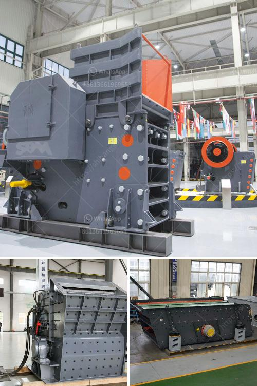

<h3>sales of vertical conveyor belts</h3>
Material handling and logistics are pivotal aspects of any industry, and businesses are continually seeking innovative solutions to enhance efficiency and productivity. With the advent of vertical conveyor belts, the traditional constraints and challenges associated with material handling have been transformed. These cutting-edge systems play a crucial role in streamlining operations by seamlessly transporting goods between different levels within a facility. Consequently, there has been a surge in the sales of vertical conveyor belts as organizations recognize their immense potential to revolutionize the way they handle materials.

The increasing popularity of vertical conveyor belts can be attributed to several factors that make them highly desirable in various industries. Firstly, they optimize space utilization by efficiently utilizing vertical space and enabling vertical movement of goods. This vertical movement eliminates the need for multiple horizontal conveyor systems, saving valuable floor space, and improving overall efficiency. Moreover, the flexible design and adaptability of vertical conveyor belts allow them to be easily integrated into existing material handling systems, offering immense convenience to businesses across diverse sectors.

Efficiency and cost-effectiveness are two paramount concerns for every business. Vertical conveyor belts address these concerns by automating the material handling process, reducing the reliance on manual labor, and minimizing human error. With the implementation of these efficient systems, organizations benefit from increased throughput, reduced operational costs, and enhanced overall productivity. Additionally, vertical conveyor belts enable precise control over the speed and movement of goods, ensuring a smooth and seamless operation.

The safety of workers and the prevention of accidents are critical considerations in any industrial setting. Vertical conveyor belts have robust safety systems in place to ensure the well-being of personnel and the integrity of the transported goods. Features such as emergency stop buttons, interlocking doors, and advanced sensors contribute to a secure working environment. These safety mechanisms not only protect employees but also minimize the risk of damage to goods during transportation.

The pharmaceutical, food, and automotive industries are a few examples where vertical conveyor belts have found widespread application. In the pharmaceutical sector, these belts facilitate the vertical transportation of medication, helping maintain sterility and prevent contamination. The food industry benefits from vertical conveyor belts as they enhance the hygienic handling of perishable items, reducing the risk of spoilage. Similarly, in the automotive industry, these systems support the seamless movement of various components within manufacturing facilities, streamlining production efficiency.

As the demand for vertical conveyor belts continues to rise, manufacturers have been quick to introduce several advancements. These include improved belt designs, integration with advanced robotic systems, and enhanced software controls for increased customization and adaptability. These innovations further enhance the appeal and sales of vertical conveyor belts, positioning them as indispensable tools for modern material handling and logistics.

In conclusion, the sales of vertical conveyor belts have witnessed a significant surge due to their transformative impact on material handling. These state-of-the-art systems optimize space utilization, automate operations, ensure worker safety, and improve productivity. With constant advancements and their ability to cater to various industries, vertical conveyor belts are set to play an increasingly vital role in revolutionizing the way businesses handle materials. As organizations recognize the long-term benefits of these innovative systems, the sales of vertical conveyor belts are expected to continue their upward trajectory in the coming years.
<h3>Contact us</h3><ul><li><strong>Whatsapp:&nbsp;<a href="https://wa.me/8613661969651">+8613661969651</a></strong></li><li><a href="https://swt.shibang-china.com/?git&amp;zhl&amp;sales of vertical conveyor belts"><strong>Online Service(chat now)</strong></a></li></ul><h3>Related</h3><ul><li><a href='grinding machinery manufecture in africa.md'>grinding machinery manufecture in africa</a></li><li><a href='quarry machine manfacturer.md'>quarry machine manfacturer</a></li><li><a href='used cement crushers for sale.md'>used cement crushers for sale</a></li><li><a href='diagram of vertical hammer mill.md'>diagram of vertical hammer mill</a></li><li><a href='to set up a stone crushing plant in bhutan.md'>to set up a stone crushing plant in bhutan</a></li></ul>