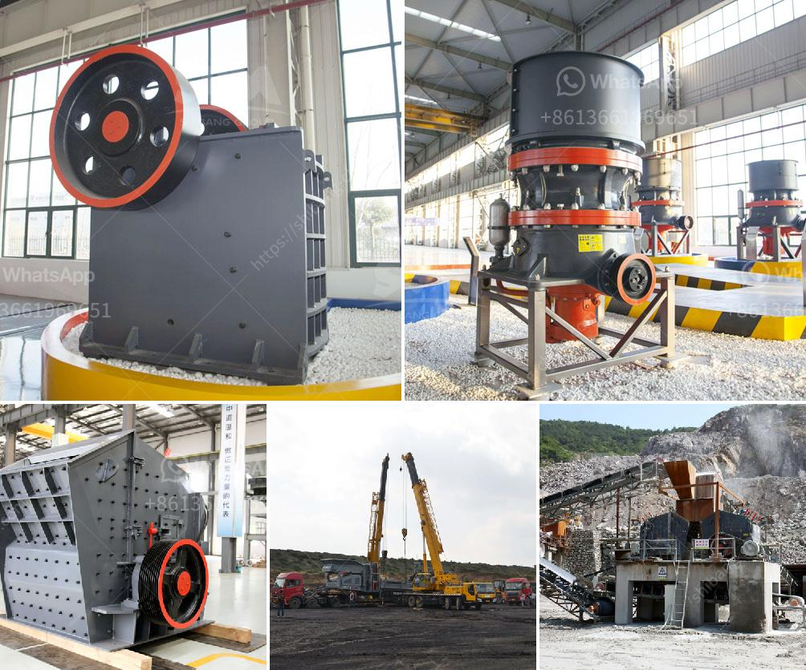

<h3>sample of granite quarry proposal</h3>
A granite quarry is a lucrative venture for both individual quarry owners and investors who are interested in the industry. As a potential quarry owner, you are faced with numerous questions regarding how to start a granite quarry. What equipment and machinery will you need to get started? How should the material be crushed for maximum profit? What should be included in the proposal to ensure that all parties are on the same page?

A granite quarry typically yields a variety of granite that is used for various purposes in different industries including construction, granite countertops, landscaping, and paving. Before starting a granite quarry, you need to have a solid business plan in place.

The proposal should outline where the quarrying will take place, the operational setup, manpower, and the estimated cost of production. Depending on your location, the quarry may be required to comply with local laws and regulations.

To start a granite quarry, you will need to make a comprehensive business plan, analyze the potential returns on investment, set-up and run the quarry, manage the operational activities, and recruit and manage manpower. You will also need to explore the opportunities of selling the granite after the quarrying operations have ceased.

1. Write a business plan. For a business as complex as a granite quarry, you need to have a very detailed business plan. The granite quarry business plan should have a detail of all aspects of your business including; the estimated capital you need to get started, how the capital will be sourced, the ideal location for your quarry, equipments you will need, the number of workers that will work on the quarry; the business structure of the quarry.

2. Set up a team. It is important to have a team of experts to analyze the business and technical operations of the quarry, identify the potential challenges that might arise, and determine how to address them. Quarrying operations require different expertise in areas such as quarry development, establishing a sustainable mining plan, operation management, and environmental protection.

3. Secure the site. You need to identify a suitable location for your granite quarry, and secure a suitable title or lease for the operation. You should also invest in comprehensive site surveys to confirm the quality and quantity of granite available at the location.

When drafting a granite quarry business plan, you should include the analysis of how profitable the venture will be. This includes the financial analysis as well – setting up a granite quarry can be very expensive, so you need to consider sources of capital, overhead costs and additional operations alongside your estimated income.

In conclusion, a granite quarry business is a profitable venture that requires a lot of strategic planning to start and grow. Further, a sample granite quarry business plan template should have the following key areas:

By following the guidelines outlined above, you can create a proposal that can secure the necessary resources for your granite quarrying operations. Remember, a well-written proposal not only showcases your expertise and vision but also conveys your commitment to following the necessary regulations and providing a valuable asset to the community and industry.
<h3>Contact us</h3><ul><li><strong>Whatsapp:&nbsp;<a href="https://wa.me/8613661969651">+8613661969651</a></strong></li><li><a href="https://swt.shibang-china.com/?git&amp;zhl&amp;sample of granite quarry proposal"><strong>Online Service(chat now)</strong></a></li></ul><h3>Related</h3><ul><li><a href='machinery crushing machine.md'>machinery crushing machine</a></li><li><a href='talc grinding machine manufacturer from uzbekistan.md'>talc grinding machine manufacturer from uzbekistan</a></li><li><a href='crusher machine capacity 5 tons per hour.md'>crusher machine capacity 5 tons per hour</a></li><li><a href='crusher pew jaw crusher.md'>crusher pew jaw crusher</a></li><li><a href='hydrated lime powder making machine from germany.md'>hydrated lime powder making machine from germany</a></li></ul>