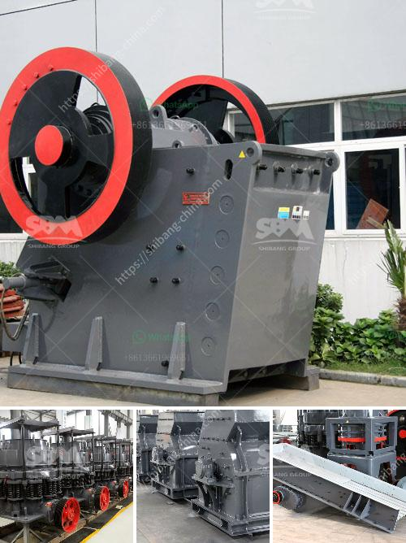

<h3>sample quarry business plan</h3>
A sample quarry business plan example can show you how to prepare your own business plan. This can potentially save you some serious time and money!

The rock quarry plant may be in 4 steps: quarry planning, securing a quarry site, choose the quarry equipment, operate and maintain the plant.

Steady progression in granite quarrying usually is achieved by comforming to a plan of rock that can be extracted systematically and without interruption for a long period of time. Parallel to this, it's important to identify and establish a rock quarrying method and set up quarrying equipment.

To ensure a high quality product that is strong, durable, and reliable, it’s important to consider a range of factors when planning for the quarry. This involves evaluating certain characteristics of the rock deposit, including geological structure, chemical composition, hardness, and other physical properties.

Prior to selecting the location and planning the extraction process, you must determine that the deposit is economically viable. This will require a market research study to evaluate demand and supply for your product.

After confirming the market demand, the next step is to secure a suitable quarry site that has been tested for quality and availability. It's crucial to ensure that the site has a sufficient quantity of resources for long-term extraction. Additionally, acquiring the necessary permits and complying with environmental regulations are essential steps in securing the site.

Once the quarry site is secured, you will need to choose the appropriate quarry equipment, including crushers, screens, and loaders. This equipment will be used to facilitate the extraction and processing of the rocks to meet the demands of the market.

Finally, operating and maintaining the quarry plant efficiently and effectively is crucial for ensuring productivity and profitability. This includes routine maintenance, regular inspections, and implementing safety measures to protect workers and the environment.

Overall, a sample quarry business plan will assist you in achieving success for your own business in the quarrying industry. So, take advantage of it wisely and ensure that you allocate enough time, effort, and resources to achieve your goals.
<h3>Contact us</h3><ul><li><strong>Whatsapp:&nbsp;<a href="https://wa.me/8613661969651">+8613661969651</a></strong></li><li><a href="https://swt.shibang-china.com/?git&amp;zhl&amp;sample quarry business plan"><strong>Online Service(chat now)</strong></a></li></ul><h3>Related</h3><ul><li><a href='100tpd cement plant cost in india.md'>100tpd cement plant cost in india</a></li><li><a href='stone crushet 10 tons.md'>stone crushet 10 tons</a></li><li><a href='mobile crusher for sale in philippines.md'>mobile crusher for sale in philippines</a></li><li><a href='crusher machine nigeria.md'>crusher machine nigeria</a></li><li><a href='raymond mill and high pressure difference.md'>raymond mill and high pressure difference</a></li></ul>