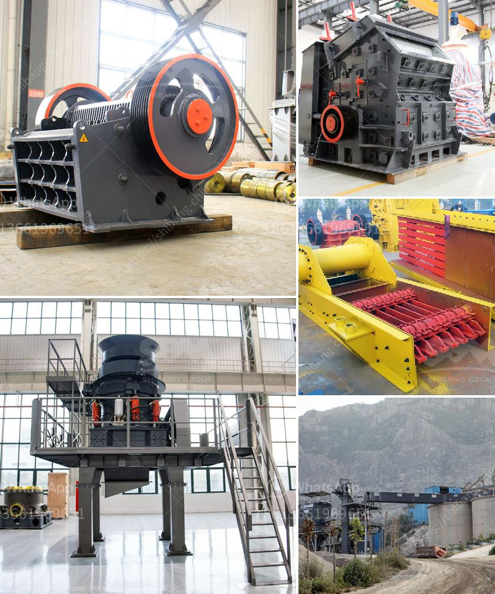

<h3>sand and gravel separator machine for sale philippines</h3>
Despite the large number of concrete batching plants and gravel pits in operation in the Philippines, there is still a considerable amount of building materials such as sand and gravel that are not properly utilized. With the increasing demand for these materials in construction projects, there is a need for equipment that can effectively separate these resources and make them suitable for various applications. This is where the sand and gravel separator machine comes into play.

The sand and gravel separator machine for sale Philippines is a versatile screening machine that can perform efficient separation processes for gravel, sands, and aggregates. It consists of a inclined vibrating screen, adjustable screen frame, and driving unit.

Unlike other traditional vibrating screens, the sand and gravel separator machine adopts the structure of small amplitude, high frequency, large obliquity to make the screen hold the capability of high efficiency, large processing capacity, long service life, low noise, and advantageous to screening the materials with different sizes.

The sand and gravel separator machine is suited for large-scale stone processing plants, quarries, and mineral processing plants. The vibrating screen separator delivers purified crushed stone materials or gravels to different customers simultaneously, which can meet the diverse needs of industries such as mining, building materials, metallurgy, transportation, water conservancy and chemical industry.

However, there are various types of sand and gravel separator machine that are available in the market, and each one comes with unique features and capabilities. It is essential to consider specific factors before making a purchase. Firstly, the size of the machine should be appropriate for the amount of material you need to process. Secondly, the machine should have an adjustable screen frame to accommodate different sizes of materials. Lastly, the machine should be easy to operate, maintain, and clean to maximize productivity.

When looking for sand and gravel separator machines for sale in the Philippines, it is important to determine the needs of your business and carefully evaluate the machine's features, production capacity, energy consumption, and maintenance requirements. It is also advisable to check the reputation and reliability of the manufacturer or supplier.

Fortunately, there are reputable companies in the Philippines that provide high-quality sand and gravel separator machines with excellent after-sales service and technical support. These companies offer a wide range of machines that are suitable for various applications, ensuring that you will find the perfect equipment that meets your needs and budget.

In conclusion, the sand and gravel separator machine for sale Philippines is an essential piece of equipment in construction projects and stone processing plants. For those who need to purchase a stone separator machine in the Philippines, you can rest assured that there are manufacturers and suppliers in the country that provide reliable and high-quality machines at competitive prices. With the right machine, you can efficiently separate sand and gravel and repurpose them for various applications, contributing to the sustainable development of the construction industry.
<h3>Contact us</h3><ul><li><strong>Whatsapp:&nbsp;<a href="https://wa.me/8613661969651">+8613661969651</a></strong></li><li><a href="https://swt.shibang-china.com/?git&amp;zhl&amp;sand and gravel separator machine for sale philippines"><strong>Online Service(chat now)</strong></a></li></ul><h3>Related</h3><ul><li><a href='dry iron ore processing methods.md'>dry iron ore processing methods</a></li><li><a href='crusher on rent basis in nigeria.md'>crusher on rent basis in nigeria</a></li><li><a href='price of medium quarry plant.md'>price of medium quarry plant</a></li><li><a href='micro powder grinding mill prices.md'>micro powder grinding mill prices</a></li><li><a href='supplier of crusher equipment in ghana.md'>supplier of crusher equipment in ghana</a></li></ul>