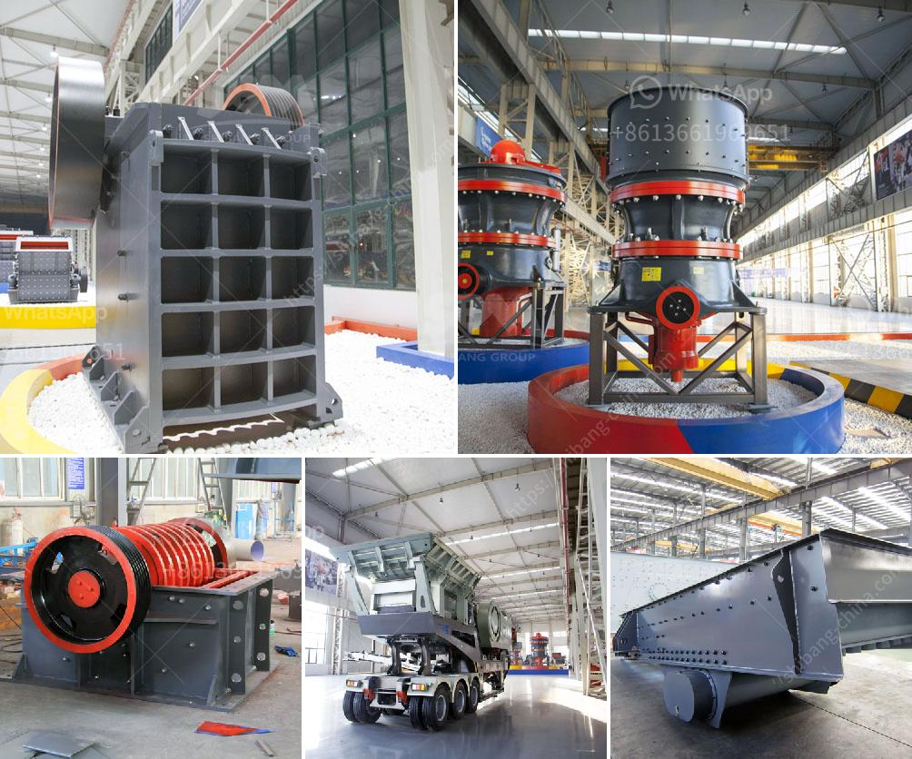

<h3>sand conveyors for rent</h3>
When it comes to handling bulk materials like sand, nothing beats the convenience and efficiency of sand conveyors. These powerful machines eliminate the need for manual labor, allowing for a streamlined and cost-effective operation. Whether you need to move sand from one location to another or load it onto trucks for transport, renting a sand conveyor is the perfect solution.

With a sand conveyor, you can quickly and effortlessly transfer sand over long distances and at varying heights. These conveyors consist of a belt or chain that transports the material from one point to another. The belt is driven by a motor, providing the necessary power to move the sand with minimal effort. The speed and direction of the belt can be easily adjusted to meet your specific requirements.

Renting a sand conveyor offers several advantages. Firstly, it saves you time and labor. Instead of relying on manual labor to move sand from one place to another, a conveyor does the job efficiently and effectively. Additionally, using a conveyor reduces the risk of injuries and accidents associated with manual handling.

Secondly, sand conveyors allow for precise control over the material flow. You can quickly load trucks or stockpile sand on-site, ensuring a smooth and continuous operation. By adjusting the speed and direction of the conveyor, you can easily control the amount of sand being transported, preventing overloading or underloading.

Furthermore, renting sand conveyors is a cost-effective option. Instead of purchasing specialized equipment that may only be needed for a limited period, renting allows you to save on upfront costs. You only pay for the duration of the rental, allowing you to allocate your budget to other essential aspects of your project.

In conclusion, sand conveyors for rent are the ideal choice for efficient material handling, especially in industries that deal with bulk materials like sand. Their ability to transport sand over long distances, at varying heights, and with precise control makes them indispensable for any construction or landscaping project. By opting for rental, you can save time, labor, and money, making sand conveyors a smart investment for your business.
<h3>Contact us</h3><ul><li><strong>Whatsapp:&nbsp;<a href="https://wa.me/8613661969651">+8613661969651</a></strong></li><li><a href="https://swt.shibang-china.com/?git&amp;zhl&amp;sand conveyors for rent"><strong>Online Service(chat now)</strong></a></li></ul><h3>Related</h3><ul><li><a href='kolberg pioneer ft4240 impact crusher.md'>kolberg pioneer ft4240 impact crusher</a></li><li><a href='part of ball mills.md'>part of ball mills</a></li><li><a href='calcium carbonate manufacturing machinery.md'>calcium carbonate manufacturing machinery</a></li><li><a href='cost or operating stone quarry and crusher.md'>cost or operating stone quarry and crusher</a></li><li><a href='stone crusher cebu for sale in kenya.md'>stone crusher cebu for sale in kenya</a></li></ul>