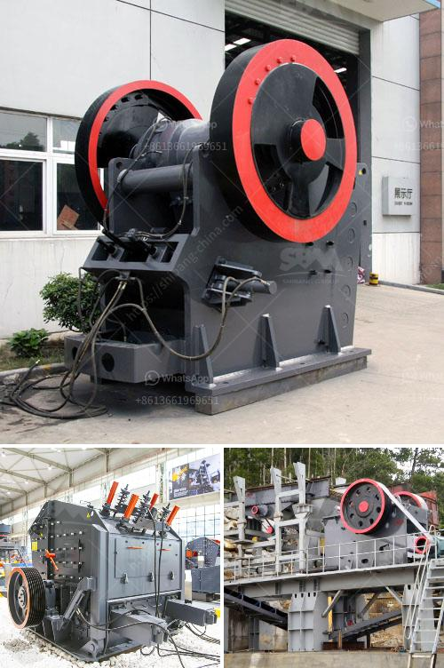

<h3>sand crushing and screening hire</h3>
In the realm of construction projects, sand plays an essential role as a base material for foundations, roads, and buildings. However, obtaining high-quality sand can be a daunting task, especially when it comes to searching for the right equipment to crush and screen the material. Fortunately, sand crushing and screening hire services offer an affordable solution for construction projects of all sizes.

Sand crushing and screening hire services typically involve the rental of equipment that can easily and efficiently crush and screen sandstone, gravel, limestone, and other aggregates. This equipment is typically portable, making it the perfect choice for construction sites that require frequent mobility. Moreover, the equipment is designed to produce high-quality sand that meets specific size requirements.

One of the key advantages of sand crushing and screening hire services is the cost-effectiveness they bring to construction projects. Investing in specialized equipment for sand crushing and screening can be expensive, especially for smaller construction companies or contractors who may not have a constant need for such equipment. By opting for a rental service, these companies can save on the upfront cost of equipment and allocate those resources to other crucial aspects of the project.

Sand crushing and screening hire services also provide flexibility, as they allow companies to acquire equipment only for the duration of the project. This eliminates the need for long-term equipment storage, regular maintenance, and worries about potential machine obsolescence. Such flexibility enables construction companies to remain agile and adjust their equipment requirements based on the evolving needs of their projects.

Another advantage of sand crushing and screening hire services is the access to specialized equipment and expertise. Rental companies often offer a wide range of crushing and screening machines specifically designed for efficient sand production. These machines are equipped with advanced features, such as adjustable speed control, remote operation capabilities, and high throughput capacities. In addition, rental companies can provide experienced operators or offer training on how to operate the equipment effectively. This ensures optimal sand quality and minimizes the risk of equipment damage or inefficiency due to improper handling.

Sand crushing and screening hire services also contribute to environmental sustainability. By utilizing specialized equipment, companies can minimize waste and ensure that only the required amount of sand is produced. Furthermore, the use of efficient machinery reduces energy consumption, resulting in lower carbon emissions. This not only benefits the environment but also aligns with the growing trend of environmentally friendly construction practices that many clients and regulatory bodies highly value.

In conclusion, sand crushing and screening hire services offer an affordable and practical solution for construction projects of all sizes. These services provide cost-effectiveness, flexibility, access to specialized equipment, and expertise, as well as contribute to environmental sustainability. By renting sand crushing and screening equipment, construction companies can focus on delivering high-quality projects while minimizing upfront costs, optimizing workflow, and reducing their environmental footprint. Thus, sand crushing and screening hire services are a worthy investment for any construction project that requires top-notch sand materials.
<h3>Contact us</h3><ul><li><strong>Whatsapp:&nbsp;<a href="https://wa.me/8613661969651">+8613661969651</a></strong></li><li><a href="https://swt.shibang-china.com/?git&amp;zhl&amp;sand crushing and screening hire"><strong>Online Service(chat now)</strong></a></li></ul><h3>Related</h3><ul><li><a href='crusher machine price in saudi.md'>crusher machine price in saudi</a></li><li><a href='ceramic crushing production line.md'>ceramic crushing production line</a></li><li><a href='philippines second hand stone crusher.md'>philippines second hand stone crusher</a></li><li><a href='cotizacion de equipos mineros.md'>cotizacion de equipos mineros</a></li><li><a href='mining equipment for hire zimbabwe.md'>mining equipment for hire zimbabwe</a></li></ul>