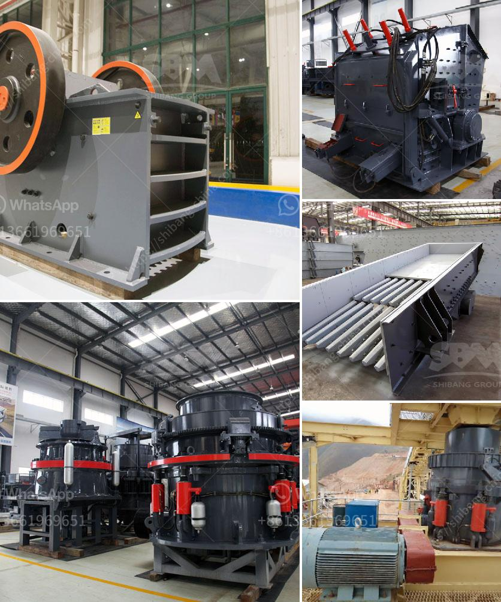

<h3>sand crushing machine</h3>
Sand crushing machines are used to produce artificial sand, which is an alternative to natural sand. Crushed sand, also known as manufactured sand, is made by crushing rocks, stones, and aggregates to the specified size. The crushing process often involves several stages of operation and can be classified into primary crushing, secondary crushing, and tertiary crushing. Sand crushing machines create finer particles by crushing aggregates and reducing particle sizes to meet specific requirements.

Sand crushing machines are popular in the construction industry for several reasons. They not only provide strong support for the building structure but also help improve the quality of concrete and reduce environmental impacts. With the increasing scarcity of natural sand resources and stricter environmental protection regulations, the demand for manufactured sand is growing rapidly.

One of the main advantages of sand crushing machines is their ability to produce cubical-shaped end products. This shape is important for concrete and asphalt production as it ensures better workability and uniformity of the final product. The particles’ angular shape also improves their interlocking properties, resulting in stronger and more durable concrete structures.

Sand crushing machines come in different types and capacities. The most common ones are jaw crushers, cone crushers, and vertical shaft impact crushers. Jaw crushers use compression force to break the particles. They are used to produce coarse aggregates that can be used in a variety of construction projects. Cone crushers use compression and eccentric motion to break down larger rocks into smaller particles. They are commonly used for secondary or tertiary crushing. Vertical shaft impact crushers are known for their ability to produce cubical-shaped end products and are commonly used in the production of artificial sand.

In sand crushing machines, factors such as material properties, specific gravity, moisture content, and particle size distribution determine the crushing process and the gradation of the final product. The selection of the right crushing equipment is critical for achieving the desired particle size distribution and meeting specifications.

To ensure efficient and safe operation, sand crushing machines are equipped with various safety features. These include safety guards, warning lights, emergency stops, and interlocks. Regular inspections and maintenance are necessary to keep the machines in good working condition and to prevent breakdowns.

Overall, sand crushing machines play an essential role in the production of manufactured sand. They help meet the increasing demand for sand, provide high-quality aggregates for construction projects, and address environmental concerns related to the depletion of natural sand resources. To ensure optimal performance and productivity, it is important to select the right type of machine, regularly maintain it, and follow proper safety procedures. With the advancement in crushing technology, sand crushing machines continue to evolve, providing improved efficiency and environmental performance in the construction industry.
<h3>Contact us</h3><ul><li><strong>Whatsapp:&nbsp;<a href="https://wa.me/8613661969651">+8613661969651</a></strong></li><li><a href="https://swt.shibang-china.com/?git&amp;zhl&amp;sand crushing machine"><strong>Online Service(chat now)</strong></a></li></ul><h3>Related</h3><ul><li><a href='quarry crusher equipment for sale.md'>quarry crusher equipment for sale</a></li><li><a href='how to build a gold washing plant.md'>how to build a gold washing plant</a></li><li><a href='project feasibility report on stone crusher.md'>project feasibility report on stone crusher</a></li><li><a href='calcium carbonate powder mill price.md'>calcium carbonate powder mill price</a></li><li><a href='small scale crushing plant.md'>small scale crushing plant</a></li></ul>