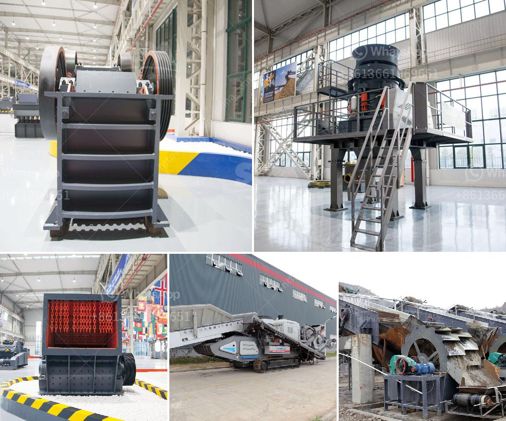

<h3>sand making machine in south africa</h3>
The sand making machine is widely used in the production of construction sand and gravel in South Africa. It is an essential machine for sand making and shaping. With the rapid development of infrastructure construction in South Africa, the demand for sand making machines is increasing.

South Africa is rich in mineral resources. The government is actively promoting the development of mining industry in order to utilize these resources effectively. To meet the infrastructure construction needs, the mining industry has been booming, and a great quantity of sand and gravel is needed. Therefore, the sand making machine has become a major equipment in this field.

The sand making machine is a device that uses the raw materials to meet the production requirements of sand and gravel. Faced with the increasingly tight mining resources, the sand making machine must continuously upgrade and innovate to improve security and efficiency. In response to the different requirements of customers, manufacturers are constantly striving to produce sand making machines that can better meet the needs of customers.

In recent years, a number of new sand making machines have been developed and put into use. The VSI6X vertical shaft impact crusher, as one of the most advanced sand making machines in the world, has a number of independent patent rights. It is a new and efficient crusher with a large amount of crushing ratio, uniform product size, low power consumption, easy maintenance, and low operating costs. It has become the preferred equipment for sand and gravel aggregate processing.

The sand making machine in South Africa is also equipped with advanced electronic control operating system, which can realize remote control, simple operation and easy maintenance. With the increasing demand for sand and gravel aggregate production in South Africa, the cost of sand making machine is gradually increasing, and the market competition is fierce. Therefore, the price of sand making machine has become one of the important factors that customers consider when purchasing machine.

In South Africa, in addition to the irrational allocation of sand and gravel, low-quality sand and gravel are also in short supply and the supply is not able to meet the market demand. The sand making machine in South Africa solves the problem of uneven distribution and low quality of sand and gravel. In addition, the sand making machine produces high-quality sand and gravel materials, which can create higher economic benefits for users, and also enables users to have higher profits.

In summary, the sand making machine in South Africa is an important equipment for making sand and shaping. Therefore, the development and research of sand making machine in South Africa should be implemented more More + vigorously. In addition, South Africa's environmental policy and market demand require that the development of the sand making industry in South Africa be driven by innovation.
<h3>Contact us</h3><ul><li><strong>Whatsapp:&nbsp;<a href="https://wa.me/8613661969651">+8613661969651</a></strong></li><li><a href="https://swt.shibang-china.com/?git&amp;zhl&amp;sand making machine in south africa"><strong>Online Service(chat now)</strong></a></li></ul><h3>Related</h3><ul><li><a href='quarry machines for sale in kenya.md'>quarry machines for sale in kenya</a></li><li><a href='mobile gypsum crusher.md'>mobile gypsum crusher</a></li><li><a href='how to build a gold washing plant.md'>how to build a gold washing plant</a></li><li><a href='mining quarry equipment for sale sri lanka.md'>mining quarry equipment for sale sri lanka</a></li><li><a href='coal crusher manufacturer.md'>coal crusher manufacturer</a></li></ul>