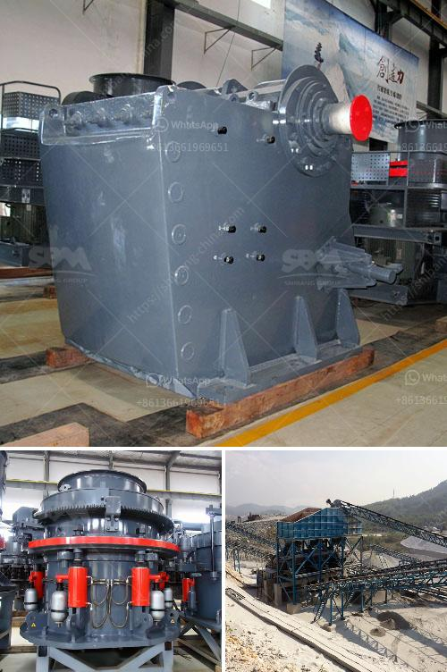

<h3>sand manufacturing machine</h3>
Sand is an essential component in many construction and manufacturing industries. Its natural abundance and versatility make it a valuable resource for various purposes, ranging from making concrete to creating glass products. To meet the high demand for sand, the invention of sand manufacturing machines has revolutionized the industry by providing an efficient and sustainable solution.

Sand manufacturing machines, also known as sand making machines or vertical shaft impactors (VSI), are capable of producing artificial sand. They are designed to reduce large rocks into small, uniform particles. These machines use a high-speed rotor and anvils for impact crushing, resulting in a consistent shape and gradation of sand.

One of the key advantages of sand manufacturing machines is their ability to produce high-quality sand that meets the required specifications. The controlled manufacturing process ensures that the sand is free from impurities and has a uniform grain size distribution. This consistency in quality makes it suitable for a wide range of applications, such as construction, infrastructure development, and manufacturing of concrete products.

Additionally, sand manufacturing machines offer cost and environmental benefits. By reducing the reliance on natural sand, these machines help preserve natural resources and protect the environment. They also eliminate the need for extensive sand mining, which often leads to ecological damage and habitat destruction.

The usage of sand manufacturing machines has gained popularity in recent years, especially in regions facing a shortage of natural sand. These machines provide a sustainable alternative, ensuring a continuous supply of sand for various industries. Moreover, the flexibility of sand manufacturing machines allows for customization, enabling manufacturers to produce sand of specific sizes and shapes to meet their requirements.

In conclusion, sand manufacturing machines play a crucial role in meeting the demand for sand in various industries. Their ability to produce high-quality sand, reduce environmental impact, and offer customization options make them an essential tool for modern construction and manufacturing processes. As the world progresses towards sustainable practices, sand manufacturing machines pave the way for a greener and more efficient future.
<h3>Contact us</h3><ul><li><strong>Whatsapp:&nbsp;<a href="https://wa.me/8613661969651">+8613661969651</a></strong></li><li><a href="https://swt.shibang-china.com/?git&amp;zhl&amp;sand manufacturing machine"><strong>Online Service(chat now)</strong></a></li></ul><h3>Related</h3><ul><li><a href='cost of grizzly crusher.md'>cost of grizzly crusher</a></li><li><a href='ball mill forge price.md'>ball mill forge price</a></li><li><a href='roll ball mill industries.md'>roll ball mill industries</a></li><li><a href='roll crusher zenith.md'>roll crusher zenith</a></li><li><a href='quarry crusher equipment for sale.md'>quarry crusher equipment for sale</a></li></ul>