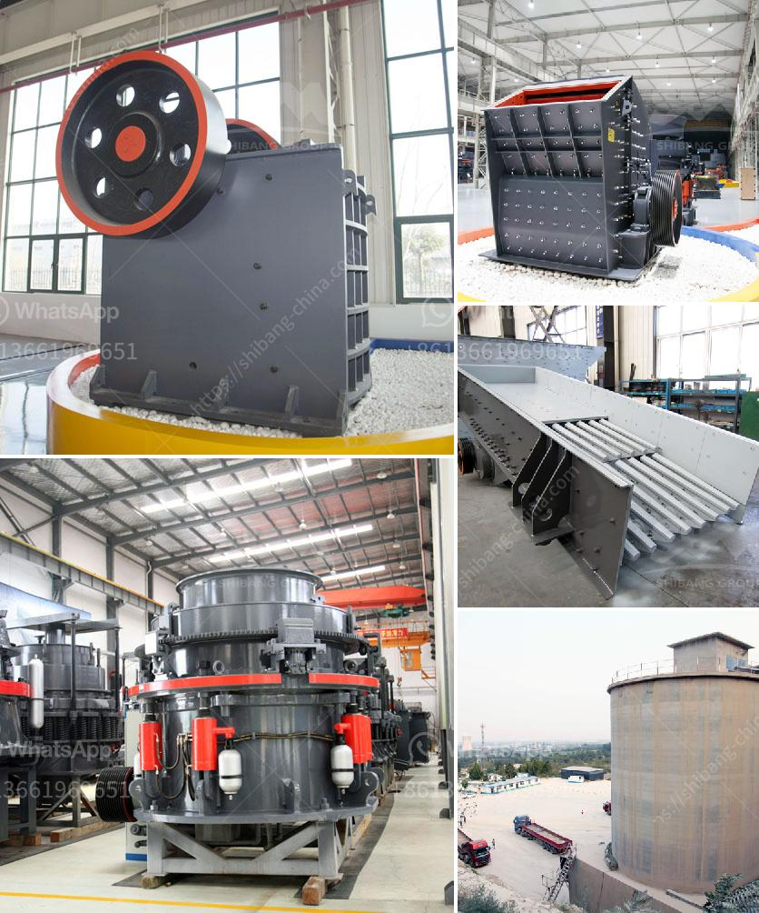

<h3>sand production project cost in india</h3>
Sand is one of the most essential natural resources that plays a significant role in various industries and construction projects. In India, with its booming infrastructure sector and rapid urbanization, the demand for sand has been increasing exponentially. However, the extraction and production of sand have become a subject of concern due to environmental issues and rising costs.

The cost of sand production in India is influenced by several factors, including the location of the project, the type of sand required, and the method of extraction. In recent years, the cost of sand production has risen significantly, primarily due to stricter regulations on sand mining and the depletion of easily accessible sources. This has led to a shift in sand mining practices, promoting sustainable and eco-friendly alternatives.

One significant factor affecting sand production costs is the location of the project. India has various regions with different availability and quality of sand. If the demand for sand is higher than the supply in a specific area, transportation costs increase, affecting the overall project cost. Moreover, environmental factors, such as proximity to rivers or coastal areas, affect the ease of extraction, thereby impacting the project cost.

Another crucial aspect influencing sand production costs is the type of sand required for a specific project. Different industries and construction projects may require specific sand types, such as fine sand, coarse sand, or even specialized sands like plastering or filter sand. The availability and suitability of these different types of sand affect the overall project cost.

Furthermore, the method of extraction plays a significant role in determining the cost of sand production. Traditional methods, such as riverbed sand mining, have become increasingly unsustainable due to ecological concerns. As a result, alternative methods, such as quarrying or crushed sand production, have gained popularity. These alternative methods involve additional costs, such as machinery and infrastructure required for extraction, processing, and transportation.

Additionally, stricter regulations on sand mining have been implemented to tackle environmental degradation caused by unregulated sand extraction. These regulations have led to higher compliance costs, including obtaining necessary permits, following environmental norms, and adopting sustainable mining practices. While these measures are crucial for safeguarding the environment, they have also contributed to the increase in sand production costs.

Overall, the cost of sand production in India has witnessed a significant rise due to various factors, including location, type of sand required, and the method of extraction. Moreover, strict regulations on sand mining and environmental concerns have further escalated the costs involved. It is essential for the industry and policymakers to focus on sustainable and eco-friendly sand production practices to ensure the availability of this vital resource for future generations. Additionally, investments in research and development of alternative materials or methods can help reduce the dependence on sand and mitigate the environmental impact associated with its production.
<h3>Contact us</h3><ul><li><strong>Whatsapp:&nbsp;<a href="https://wa.me/8613661969651">+8613661969651</a></strong></li><li><a href="https://swt.shibang-china.com/?git&amp;zhl&amp;sand production project cost in india"><strong>Online Service(chat now)</strong></a></li></ul><h3>Related</h3><ul><li><a href='quarry crusher equipment for sale.md'>quarry crusher equipment for sale</a></li><li><a href='stone crusher in pakistan.md'>stone crusher in pakistan</a></li><li><a href='kaolin dry beneficiation.md'>kaolin dry beneficiation</a></li><li><a href='ansporting coal conveyor belt.md'>ansporting coal conveyor belt</a></li><li><a href='lime making machine.md'>lime making machine</a></li></ul>