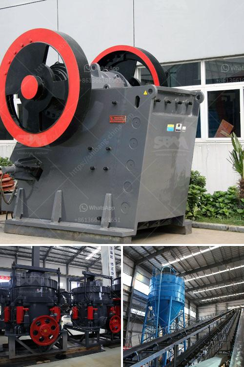

<h3>sand stone factory equipment</h3>
Sandstone is a popular building material due to its durability and aesthetic appeal. To meet the growing demand for sandstone products, sandstone factories rely on specialized equipment to efficiently process and shape raw materials into finished products. In this article, we will explore the important machinery and tools utilized in a sandstone factory and their significance in the overall production process.

One of the primary pieces of equipment found in a sandstone factory is the cutting machine. This machine is used to saw large blocks of sandstone into smaller slabs or tiles of desired dimensions. Typically, diamond-tipped blades are employed for cutting, as they possess the necessary hardness and strength to slice through the tough sandstone material. High precision and accuracy are essential in this step to ensure that the slabs maintain uniform thickness and smooth edges.

Once the sandstone blocks are cut into the desired sizes, they are refined using a grinding and polishing machine. This machine facilitates the removal of any rough surfaces or imperfections and gives the sandstone a smooth and glossy finish. The grinding process involves the use of abrasive materials such as sandpaper or grinding wheels that gradually smoothen the surface by removing small amounts of material. Polishing then follows, wherein finer grits are used to achieve a refined, shiny appearance.

In addition to cutting and surface treatment, sandstone factories also utilize shaping machines. These machines allow for precise carving, engraving, and shaping of the sandstone. Intricate designs and patterns can be embossed onto the surface, making the sandstone suitable for decorative purposes. Shaping machines are computer-controlled, enabling artisans to create customized designs with exceptional precision. This automation not only saves time but also ensures consistency in the final product quality.

Moulding machines are another essential equipment in a sandstone factory. They are used to create various sandstone products such as pillars, balusters, and decorative elements. These machines employ molds made of metal or other materials to shape the sandstone into specific forms. The molds can be customized according to the desired shape and design requirements. By using moulding machines, sandstone factories can mass-produce standardized products efficiently.

To facilitate transportation and handling within the factory, equipment such as forklifts and cranes are crucial. These machines are responsible for lifting and moving heavy sandstone slabs, blocks, and finished products from one location to another. Forklifts are particularly useful when loading and unloading sandstone onto trucks for transportation to customers or external storage facilities. Cranes, on the other hand, are employed for lifting operations in confined spaces or when dealing with exceptionally heavy sandstone pieces.

In conclusion, sandstone factory equipment plays a vital role in the processing and production of sandstone products. The cutting machine, grinding and polishing machine, shaping machines, moulding machines, and material handling equipment are some of the key machines found in sandstone factories. With the aid of advanced technology and automation, these machines enable efficient and precise fabrication of sandstone, ensuring high-quality finished products that cater to the diverse needs of the construction and architectural industries.
<h3>Contact us</h3><ul><li><strong>Whatsapp:&nbsp;<a href="https://wa.me/8613661969651">+8613661969651</a></strong></li><li><a href="https://swt.shibang-china.com/?git&amp;zhl&amp;sand stone factory equipment"><strong>Online Service(chat now)</strong></a></li></ul><h3>Related</h3><ul><li><a href='crusher plants for sale in pakistan.md'>crusher plants for sale in pakistan</a></li><li><a href='jaw crusher plant in saudi.md'>jaw crusher plant in saudi</a></li><li><a href='gravel jaw crushers for sale in south africa.md'>gravel jaw crushers for sale in south africa</a></li><li><a href='crusher plant in construction.md'>crusher plant in construction</a></li><li><a href='granite crusher manufacturer.md'>granite crusher manufacturer</a></li></ul>