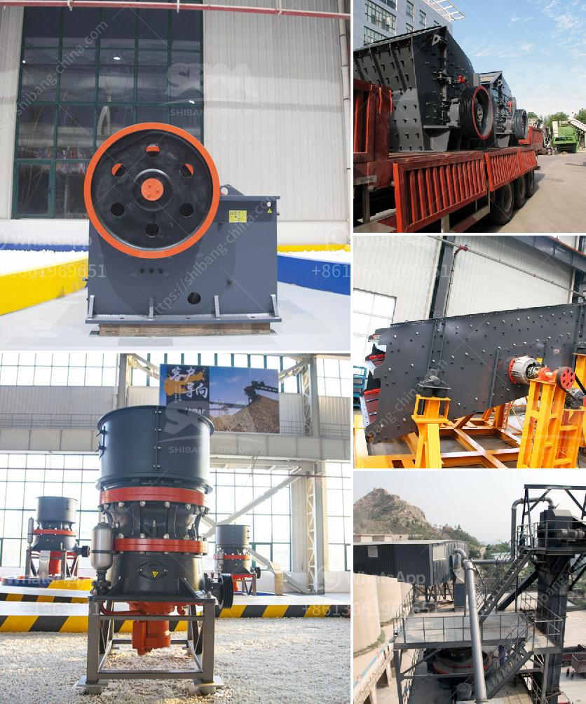

<h3>sand wash plant 50tph</h3>
A sand wash plant, also known as a sand washing plant, is a facility that washes sand and gravel to remove impurities and attain a desired particle size distribution. Materials can be from river sand, lake sand, sea sand, or sand deposits found inland. The plant usually consists of multiple washing stages, which may include screening, gravity separation, and dewatering processes. With a capacity of 50tph, a sand wash plant efficiently separates and scrubs impurities from sand to produce high-quality materials for construction and various industries.

One of the primary purposes of a sand wash plant is to remove impurities from the sand. These impurities can include clay, silt, dark minerals, organic matter, and other debris that may be present in natural sand deposits. By removing these unwanted materials, the plant ensures that the final product is clean and free of contaminants, which is critical for applications requiring high-quality sand.

The sand wash plant typically begins with a primary screening process to separate the larger particles from the smaller ones. The material is then fed into a scrubbing tank, where it is vigorously mixed with water and chemicals. The combination of mechanical agitation and chemical reactions helps in breaking down and dispersing the impurities, especially clay and organic matter. This process ensures that the particles are thoroughly cleaned and ready for subsequent stages of processing.

Once the scrubbing process is complete, the slurry is directed to a hydrocyclone for gravity separation. The hydrocyclone utilizes centrifugal force to separate the sand particles according to their size and density. This step helps in achieving a uniform particle size distribution and removes any remaining fine particles, further enhancing the quality of the sand.

After the gravity separation stage, the sand slurry undergoes a dewatering process to remove excess water. This is typically done through a combination of thickening tanks and dewatering screens. The thickening tanks allow the settling of solids, while the dewatering screens remove remaining water from the sand particles. The final result is a stackable, free-flowing sand product.

A sand wash plant with a capacity of 50tph is suitable for small to medium-sized operations. It provides the ideal balance between output and efficiency, allowing operators to process a significant amount of sand while ensuring optimal performance. Additionally, the plant's compact size makes it easy to transport and install, enabling rapid deployment and quick setup.

In conclusion, a sand wash plant with a capacity of 50tph is a versatile and essential tool for the sand industry. It effectively removes impurities, improves particle size distribution, and produces high-quality sand for various applications. Whether it's for construction, concrete production, glass manufacturing, or foundry operations, a sand wash plant ensures the production of clean, consistent, and desirable sand materials.
<h3>Contact us</h3><ul><li><strong>Whatsapp:&nbsp;<a href="https://wa.me/8613661969651">+8613661969651</a></strong></li><li><a href="https://swt.shibang-china.com/?git&amp;zhl&amp;sand wash plant 50tph"><strong>Online Service(chat now)</strong></a></li></ul><h3>Related</h3><ul><li><a href='gravimetric centrifugal gold concentrator.md'>gravimetric centrifugal gold concentrator</a></li><li><a href='limestone crushers for chicken feed production.md'>limestone crushers for chicken feed production</a></li><li><a href='top roller mills for sale.md'>top roller mills for sale</a></li><li><a href='india stone crusher machine price in china.md'>india stone crusher machine price in china</a></li><li><a href='barium sulfate production line manufacturer.md'>barium sulfate production line manufacturer</a></li></ul>