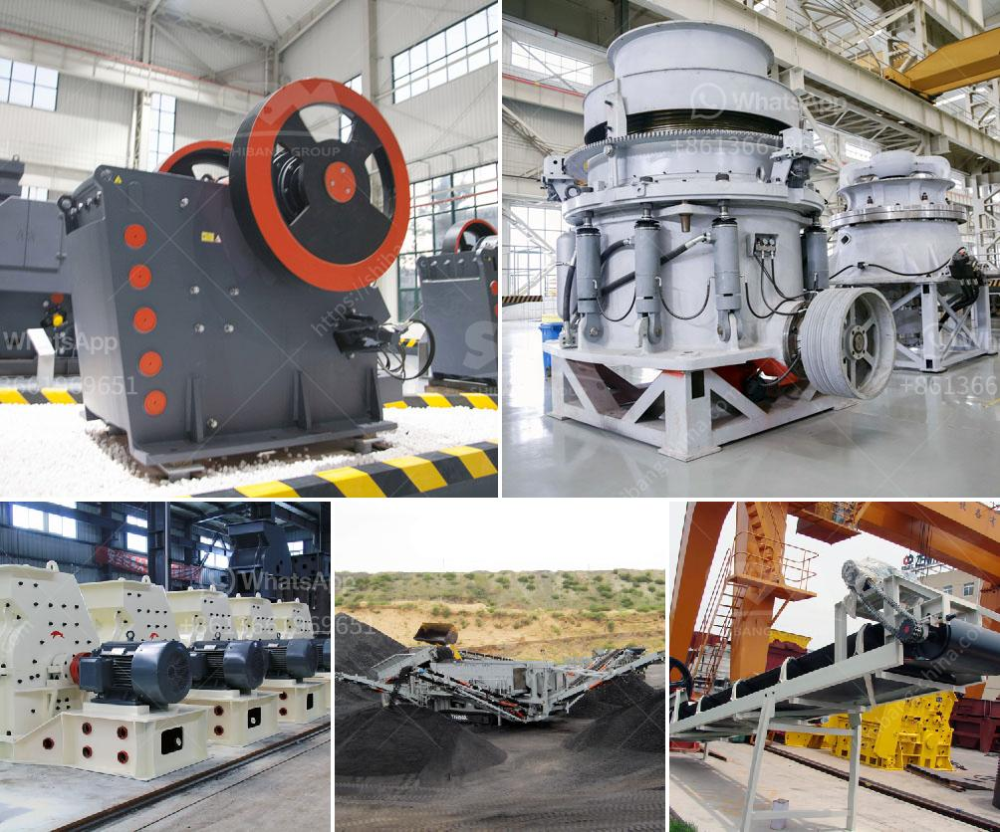

<h3>sand wash plant for sale</h3>
If you are in the construction industry or involved in the extraction of sand, you may be aware of the importance of having a reliable and efficient sand wash plant. A sand wash plant is used to wash sand and remove impurities such as dust and silt. It not only improves the quality of sand but also ensures that it meets the required specifications for use in construction projects.

If you are considering investing in a sand wash plant, you should explore the various options available in the market. One option worth considering is the sand wash plant for sale. These plants are designed for convenience and efficiency, allowing you to wash large quantities of sand quickly and effectively.

A sand wash plant for sale typically includes an array of components such as a vibrating feeder, a primary crusher, a secondary crusher, a vibrating screen, and a sand recovery system. These components work together to wash and separate sand particles, ensuring clean and high-quality sand.

The sand wash plants for sale also come in different sizes and capacities, depending on your specific requirements. Whether you need a small sand wash plant for minor construction projects or a large-scale plant for commercial sand extraction, you can find the right solution to suit your needs.

Investing in a sand wash plant for sale can offer several benefits. Firstly, it can save you time and labor by automating the washing process, eliminating the need for manual labor-intensive methods. Secondly, it can improve the quality of your sand, making it more suitable for construction projects and increasing your market competitiveness. Lastly, it can minimize environmental impact by reducing the amount of waste material that needs to be disposed of.

In conclusion, a sand wash plant for sale can be a valuable addition to your construction or sand extraction business. It offers efficient and effective sand washing, resulting in high-quality sand that meets the required standards. So, consider investing in a sand wash plant for sale and enjoy the benefits it brings to your operations.
<h3>Contact us</h3><ul><li><strong>Whatsapp:&nbsp;<a href="https://wa.me/8613661969651">+8613661969651</a></strong></li><li><a href="https://swt.shibang-china.com/?git&amp;zhl&amp;sand wash plant for sale"><strong>Online Service(chat now)</strong></a></li></ul><h3>Related</h3><ul><li><a href='cheap stone crushing plant.md'>cheap stone crushing plant</a></li><li><a href='feldspar ball mills feldspar ball mills manufacturers.md'>feldspar ball mills feldspar ball mills manufacturers</a></li><li><a href='model of crusher and steps of constructions.md'>model of crusher and steps of constructions</a></li><li><a href='price of grinding machine in india.md'>price of grinding machine in india</a></li><li><a href='cost of cassava milling machine in ghana.md'>cost of cassava milling machine in ghana</a></li></ul>