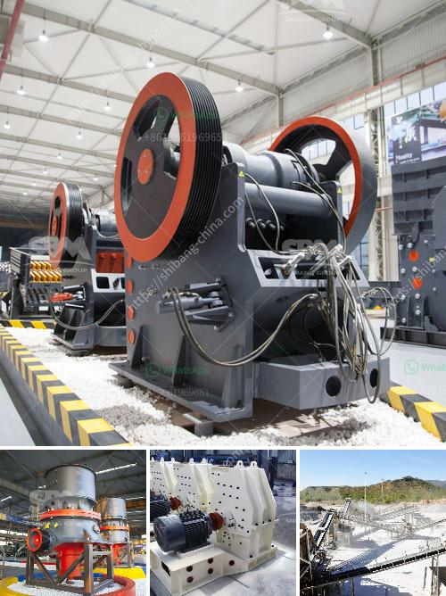

<h3>sand washing machine</h3>
Sand washing machine is an essential equipment in the production of sand. It can remove the impurities on the surface of the sand and improve the quality of the sand. It is widely used in sand washing projects such as construction sites, sand and gravel plants, glass factories, hydropower stations, and other industries.

The sand washing machine is divided into two types: wheel type and spiral type. The wheel type sand washing machine has the advantages of simple structure, less wearing parts, and small floor area. The spiral type sand washing machine has a strong cleaning ability, and can effectively clean the sand and gravel with serious mud impurities.

The sand washing machine consists of a motor, reducer, dewatering screen, impeller, impeller bearing, assembly, and frame. As an important part of the equipment, the impeller plays an important role in the cleaning process of the sand and gravel. It is made of wear-resistant materials and its service life is long.

The sand washing machine mainly uses the principle that the gravel sinks in water at different speeds to clean and classify the gravel. In the production process of the machine, the raw sand is fed into the machine through the feeding hopper, and the impeller rotating at high speed brings the sand and gravel onto the dewatering screen. Under the action of the vibration of the dewatering screen, the sand and gravel are evenly distributed and gradually moved forward. The clean sand and gravel are discharged from the top of the dewatering screen, and the mud and impurities in the sand and gravel flow into the weir trough through the overflow port, and then are discharged from the outlet.

The sand washing machine has the advantages of simple structure, low power consumption, high cleaning level, low failure rate, and long service life. It can effectively remove the impurities on the surface of the sand and improve the quality of the sand. It is an important equipment for sand washing in sand and gravel plants.

In addition, the sand washing machine also has a wide range of applications. It is not only used for washing and grading of sand and gravel in construction sites, but also for cleaning and selecting fine-grained and coarse-grained materials in quarries, ore dressing plants, power plants, and concrete mixing plants. It is also often used in sand production lines, coal preparation plants, and other industrial sectors.

With the continuous development of society, the demand for sand and gravel is increasing. Therefore, the sand washing machine plays an important role in the production of sand. It not only ensures the quality of the sand, but also protects the environment and improves the industrial production efficiency. As a necessary equipment in the sand production line, the sand washing machine will continue to develop and improve, and provide strong support for the development of various industries.
<h3>Contact us</h3><ul><li><strong>Whatsapp:&nbsp;<a href="https://wa.me/8613661969651">+8613661969651</a></strong></li><li><a href="https://swt.shibang-china.com/?git&amp;zhl&amp;sand washing machine"><strong>Online Service(chat now)</strong></a></li></ul><h3>Related</h3><ul><li><a href='mobile crushing price.md'>mobile crushing price</a></li><li><a href='gravel jaw crushers for sale in south africa.md'>gravel jaw crushers for sale in south africa</a></li><li><a href='used mobile crusher.md'>used mobile crusher</a></li><li><a href='raymond mill production line.md'>raymond mill production line</a></li><li><a href='cost of a stone crusher.md'>cost of a stone crusher</a></li></ul>