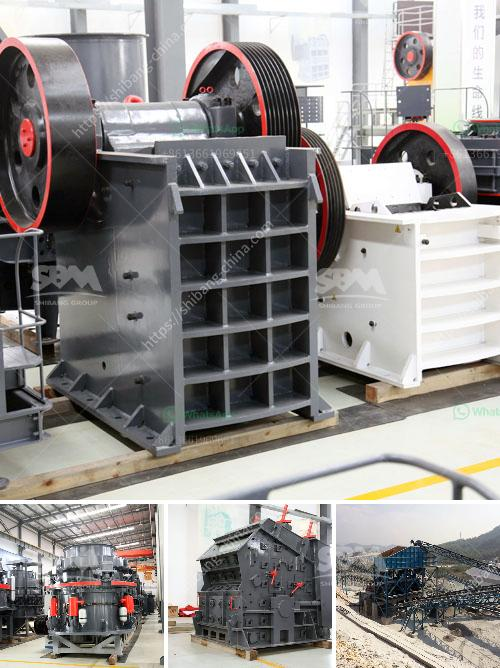

<h3>sand washing plant for sale in uae</h3>
Sand washing plant for sale in UAE is widely used for cleaning materials in the following industries: quarry, minerals, building materials, transportation, chemical industry, water conservation and hydropower, cement mixture station and so on.

With the continuous improvement of technology, more and more sand washing plants have been upgraded and have become a common equipment in the market. They are mainly based on clean sand through sand washing and recycling equipment to obtain finished sand products that meet market requirements. The sand washing plant for sale in UAE uses a modular polyurethane screen, which is provided with higher processing capacity and simpler maintenance.

The sand washing plant for sale in UAE has been used in the treating materials of dust and other impurities, such as construction waste, non-metallic mineral, coal mines, and other loose materials. The final sand output is clean, environmentally friendly, and has a uniform particle size with good grain shape, which fully meets the national standards.

The sand washing plant for sale in UAE is the main equipment for washing sand in specific situations. It can effectively remove impurities from sand products. It is important to wash and classify sand and gravel efficiently in order to obtain high-quality sand for construction and other industries. In addition, the sand washing plant is also capable of dewatering sand for valuable particle sizes, reducing material loss and improving product quality.

The sand washing plant for sale in UAE is a comprehensive system of sand washing, screening, and wastewater treatment. The whole plant is composed of crusher, sand washer, vibrating screen, dewatering screen, sand recycling equipment, belt conveyor, and electrical control system. The sand washing machine made by Luoyang Longzhong Heavy Machinery Co., Ltd. has high cleanliness, large processing capacity, low power consumption, and long service life.

The sand washing plant for sale in UAE combines various functions to meet the requirements of different customers. The crushing system in the plant mainly includes a jaw crusher for primary crushing, cone crusher for fine crushing, and impact crusher for sand making. The sand washing plant can reasonably crush, screen and clean various granular materials, such as crushed stone, sand and gravel, coal, concrete, recycled aggregate, etc. It can be used in washing process for limestone, granite, marble, basalt, iron ore, river pebble, shale, coal gangue and other materials.

The sand washing plant for sale in UAE is a highly efficient sand washing system developed by adopting advanced technology and combining domestic and foreign technology with the actual situation of domestic sand and gravel industry. It has the characteristics of high washing degree, reasonable structure and large output. The final sand product has a good shape and can meet the requirements of various construction projects.

In conclusion, the sand washing plant for sale in UAE is an indispensable equipment in the sand and gravel production line, which can effectively improve the quality of sand and gravel. It is necessary equipment for washing sand in sand and gravel industry, especially for construction sand and road construction sand. The sand washing plant for sale in UAE is of great significance to the promotion of sand industry development and environmental protection.
<h3>Contact us</h3><ul><li><strong>Whatsapp:&nbsp;<a href="https://wa.me/8613661969651">+8613661969651</a></strong></li><li><a href="https://swt.shibang-china.com/?git&amp;zhl&amp;sand washing plant for sale in uae"><strong>Online Service(chat now)</strong></a></li></ul><h3>Related</h3><ul><li><a href='cost setting up silica sand ball mill.md'>cost setting up silica sand ball mill</a></li><li><a href='100tpd complete gold plant.md'>100tpd complete gold plant</a></li><li><a href='quarry machine and crusher plant sale in philippines.md'>quarry machine and crusher plant sale in philippines</a></li><li><a href='quartz stone quarry in nigeria.md'>quartz stone quarry in nigeria</a></li><li><a href='stone crusher price.md'>stone crusher price</a></li></ul>