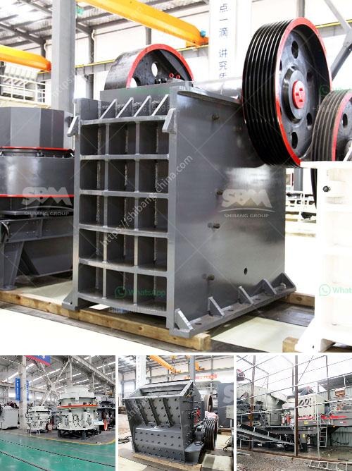

<h3>sayaji impact crusher specifications</h3>
When it comes to stone crushing, any device that is capable of reducing large stones into smaller pieces is called a crusher. As the name suggests, an impact crusher accelerates the feed material to high speeds and then flings the fast-moving rocks against the walls of the crushing chamber and each other. This collision results in a high reduction ratio and the production of fine materials. One such impact crusher is the Sayaji Vertical Shaft Impactor. 

With its compact design and high output capacity, the Sayaji impact crusher is an ideal choice for sites with tight spaces. It can easily be transported to different locations without any additional machinery or equipment. Whether it is a construction site, quarry, or recycling facility, this impact crusher can efficiently carry out its function.

One of the stand-out features of the Sayaji impact crusher is its sturdy construction. The crusher's body is made from high-quality steel plates, ensuring durability and long service life. This robustness is crucial in handling the impact forces generated during the crushing process. Additionally, the crusher is equipped with hydraulic opening mechanisms that allow for quick and easy maintenance, reducing downtime for operators.

The Sayaji impact crusher boasts impressive performance characteristics. With a high reduction ratio of 20:1 and a maximum feed size of 150mm, it can produce fine materials suitable for various applications. The impact crusher's rotor diameter of 600mm ensures efficient crushing operations, while the variable speed of the shaft allows for precise control over the product size.

Furthermore, the Sayaji impact crusher is designed to operate at a power consumption level of 75-90kW. This energy-efficient operation helps to reduce operating costs and lowers carbon emissions. With its capacity range of 70-120 TPH, this impact crusher can handle a variety of materials, making it versatile for different crushing requirements.

In conclusion, the Sayaji impact crusher specifications demonstrate the exceptional performance and reliability of this particular crushing device. With its robust construction, high reduction ratio, and efficient operation, it is an excellent choice for any stone crushing application. Whether it is a small-scale project or a larger operation, this impact crusher offers the necessary power and versatility to meet the demands of various industries. When it comes to stone crushing, the Sayaji impact crusher is a reliable and effective choice.
<h3>Contact us</h3><ul><li><strong>Whatsapp:&nbsp;<a href="https://wa.me/8613661969651">+8613661969651</a></strong></li><li><a href="https://swt.shibang-china.com/?git&amp;zhl&amp;sayaji impact crusher specifications"><strong>Online Service(chat now)</strong></a></li></ul><h3>Related</h3><ul><li><a href='cement mill startup procedures.md'>cement mill startup procedures</a></li><li><a href='roller mill grinder.md'>roller mill grinder</a></li><li><a href='transport system in a mineral crusher.md'>transport system in a mineral crusher</a></li><li><a href='roller mill cement price.md'>roller mill cement price</a></li><li><a href='raymond mill vs ball mill.md'>raymond mill vs ball mill</a></li></ul>