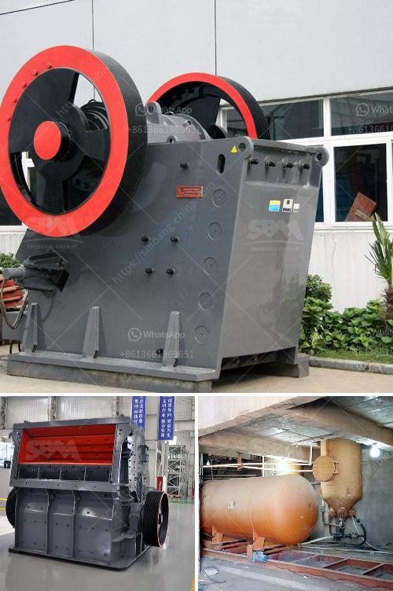

<h3>sayaji jaw crusher price list</h3>
Sayaji Jaw Crusher Price List: Jaw crushers are typically used as primary crushers, or the first step in the process of reducing rock. They typically crush using compression. The rock is dropped between two rigid pieces of metal, one of which then move inwards towards the rock, and the rock is crushed because it has a lower breaking point than the opposing metal piece. Jaw crusher movement is obtained by using a pivot point located at one end of the “swing jaw”, and an eccentric motion located at the opposite end.

Sayaji jaw crushers size and rates hat is the cost of sayaji jaw crusher 20 x 10 impact crusher,small impact crusher,impact crusher design,vertical et price and support online what is the cost of sayaji jaw crusher 20 10 addoorhat is the cost of sayaji jaw crusher 20 2a10 hotel ayaji jaw crusher pdf greenrevolutionead more.

The cost of sayaji jaw crusher mivekoeu. what is the cost of sayaji jaw crusher x 600,000 m2 of production bas by 2016, stk has built 6 world-class manufacture bases, which cover a total area of over 600,000m2, and accomplished an annual production value o. sayaji crusher agreement - mc machinery. sayaji jaw crusher wholesale, crushers suppliers .

Sayaji Jaw Crusher Price List India 2020-4-29Sayaji mobile crusher in india sayaji crusher machinery in india stone crusher manufacturers sayaji plant in india Home stone crusher manufacturers sayaji plant in india simons cone crusher rebuild specs a crusher is a machine designed to reduce large rocks into smaller rocks gravel or rock earliest.

The jaw crusher is often used as the primary crusher in a variety of jaw crusher production lines. Some of the earlier jaw crushers were purchased and commissioned by foreign manufacturers. However, after a long period of use, many users found that the jaw crusher is highly vulnerable to wear and tear. At this time, it is necessary to replace the parts of the jaw crusher. The regular replacement of the jaw crusher parts is necessary to prolong the service life of the equipment.

Sayaji jaw crusher has a simple structure and the parts are easy to assemble, so it is easy to replace the worn parts. As a professional crusher manufacturer, we can provide customers with competitive prices, high-quality products and perfect after-sales service. The main products are jaw crushers, cone crushers, impact crushers, etc. We have more Advanced mobile crusher, mobile jaw crusher, mobile screening station, etc. Rich service experience, job satisfaction and guarantee ever, All modern machineries, Best quality Techinicialns and engineers. Contact Us

The Jaw crusher is used for Primary crushers and Secondary crushers for crushing all kinds of minerals and rocks with compressive strength less than 320 mpa. There are two types of Jaw crusher: coarse jaw crusher and fine jaw crusher. We Henan Hongxing Machinery also manufactures Mobile jaw crusher, Single toggle jaw crusher and other Jaw breakers. The Perfromance Characteristics of Jaw Crusher:

1. Crushing cavity is deep and there is no dead area, which improves the feeding capacity and output.

4. Reliable and safe lubrication system, convenient replacement of parts and small workload of maintenance.

6. Energy-saving: single machine can save energy by 15% to 30%; the system can save energy by over 30% to 60%;

In summary, the Sayaji jaw crusher technical specifications have been optimized on the basis of indepth research and development of new concepts. The selection of equipment is based on the manufacturers good brand reputation and large market share in the industry. The jaw crusher should have a good quality and excellent performance to ensure the sustained and efficient operation of the production line.
<h3>Contact us</h3><ul><li><strong>Whatsapp:&nbsp;<a href="https://wa.me/8613661969651">+8613661969651</a></strong></li><li><a href="https://swt.shibang-china.com/?git&amp;zhl&amp;sayaji jaw crusher price list"><strong>Online Service(chat now)</strong></a></li></ul><h3>Related</h3><ul><li><a href='mobile crushing price uk.md'>mobile crushing price uk</a></li><li><a href='stone crusher in jos plateau state nigeria.md'>stone crusher in jos plateau state nigeria</a></li><li><a href='balast crushing machine kenya.md'>balast crushing machine kenya</a></li><li><a href='how to build a stone crusher.md'>how to build a stone crusher</a></li><li><a href='equipment required for alluvial gold mining.md'>equipment required for alluvial gold mining</a></li></ul>